# 扶贫帮扶管理系统的设计与实现

***

## 摘要

随着我国脱贫攻坚战取得全面胜利，精准扶贫工作进入巩固拓展脱贫攻坚成果同乡村振兴有效衔接的新阶段。传统的扶贫管理方式存在信息分散、流程不透明、数据统计困难等问题，难以满足新时期扶贫工作精细化、数字化的需求。本文设计并实现了一套基于 Spring Boot + Vue 3 的扶贫帮扶管理系统，旨在通过信息化手段提升扶贫工作效率，实现帮扶全过程的数字化管理。

系统采用前后端分离架构，后端基于 Java 1.8 + Spring Boot 2.7 框架，集成 MyBatis-Plus 持久层框架、Spring Security + JWT 安全认证体系、Redis 缓存中间件；前端采用 Vue 3 + TypeScript + Vite 技术栈，使用 Element Plus 组件库和 ECharts 可视化图表库。系统涵盖用户与权限管理、贫困户档案管理、帮扶结对与措施跟踪、走访记录、扶贫项目管理、困难需求与捐赠管理、就业帮扶、技能培训、志愿服务、信息公开与数据统计等核心功能模块，支持系统管理员、帮扶责任人、贫困户、志愿者四种角色的差异化访问。

经测试验证，系统功能完整、运行稳定，能够有效支撑扶贫帮扶业务的全流程管理，为扶贫工作的数字化转型提供了可靠的技术保障。

**关键词**：扶贫帮扶管理系统；Spring Boot；Vue 3；前后端分离；RBAC 权限模型

***

## ABSTRACT

With China's comprehensive victory in the battle against poverty, poverty alleviation work has entered a new stage of consolidating and expanding the achievements of poverty alleviation and effectively connecting with rural revitalization. Traditional poverty alleviation management methods have problems such as scattered information, opaque processes, and difficult data statistics, which are difficult to meet the refined and digital needs of poverty alleviation work in the new era. This paper designs and implements a poverty alleviation management system based on Spring Boot + Vue 3, aiming to improve the efficiency of poverty alleviation work through information technology and realize digital management of the entire assistance process.

The system adopts a front-end and back-end separation architecture. The back-end is based on the Java 1.8 + Spring Boot 2.7 framework, integrating the MyBatis-Plus persistence layer framework, Spring Security + JWT security authentication system, and Redis cache middleware. The front-end uses the Vue 3 + TypeScript + Vite technology stack, with the Element Plus component library and ECharts visualization chart library. The system covers core functional modules such as user and permission management, poverty-stricken household file management, assistance pairing and measure tracking, visit records, poverty alleviation project management, difficulty needs and donation management, employment assistance, skill training, volunteer services, information disclosure and data statistics, and supports differentiated access for four roles: system administrator, assistance responsible person, poverty-stricken household, and volunteer.

Tested and verified, the system has complete functions and stable operation, which can effectively support the full-process management of poverty alleviation business and provide reliable technical guarantee for the digital transformation of poverty alleviation work.

**Keywords**: Poverty Alleviation Management System; Spring Boot; Vue 3; Front-end and Back-end Separation; RBAC Permission Model

***

## 第1章 绪论

### 1.1 研究背景

消除贫困是人类共同的使命，也是中国全面建成小康社会的底线任务。党的十八大以来，以习近平同志为核心的党中央把脱贫攻坚摆在治国理政的突出位置，作为全面建成小康社会的底线任务，组织开展了声势浩大的脱贫攻坚人民战争。经过八年持续奋斗，我国如期完成了新时代脱贫攻坚目标任务，现行标准下农村贫困人口全部脱贫，贫困县全部摘帽，取得了令全世界刮目相看的重大胜利。

然而，脱贫摘帽不是终点，而是新生活、新奋斗的起点。习近平总书记指出，要切实做好巩固拓展脱贫攻坚成果同乡村振兴有效衔接各项工作，让脱贫基础更加稳固、成效更可持续。这要求我们在巩固脱贫成果的基础上，持续推进脱贫地区发展，全面推进乡村振兴。

在扶贫工作向纵深推进的过程中，传统的人工管理模式逐渐暴露出诸多问题，严重制约了扶贫工作的效率和质量。一是信息分散问题突出，贫困户档案、帮扶记录、项目信息、资金使用情况等数据分散在不同部门和人员手中，缺乏统一的管理平台，导致信息共享困难，各部门之间存在信息孤岛现象；二是帮扶流程不够透明，帮扶措施的制定、落实、评估缺乏有效的跟踪监督机制，帮扶干部的工作情况难以量化考核，帮扶效果难以科学评估；三是数据统计困难，传统的人工统计方式效率低、易出错，无法及时、准确地掌握扶贫工作进展和成效，难以为决策提供科学依据；四是社会参与渠道不畅，社会力量参与扶贫的意愿强烈，但缺乏有效的对接机制和平台，贫困户的需求与社会资源之间存在信息不对称；五是动态管理能力不足，难以实现对脱贫人口的实时动态监测和精准帮扶。

随着信息技术的快速发展，利用数字化手段提升扶贫工作水平已成为必然趋势。近年来，我国政务信息化建设取得了长足进步，电子政务、大数据、云计算等技术在政府管理中的应用日益广泛。在扶贫领域，信息化建设也取得了一定成效，全国扶贫开发信息系统实现了贫困人口的建档立卡和动态管理。但现有系统仍存在功能单一、用户体验不佳、社会参与渠道不足等问题，难以满足新时期扶贫工作精细化、数字化的需求。

在此背景下，本研究旨在设计并实现一套基于 Spring Boot + Vue 3 的扶贫帮扶管理系统，通过信息化手段解决当前扶贫工作中存在的实际问题，实现扶贫信息的集中管理、帮扶过程的全程跟踪、数据的智能分析，为巩固拓展脱贫攻坚成果、全面推进乡村振兴提供有力的技术支撑。

### 1.2 研究目的和意义

#### 1.2.1 研究目的

本研究旨在设计并实现一套基于 Spring Boot + Vue 3 的扶贫帮扶管理系统，解决当前扶贫工作中信息分散、流程不透明、数据统计困难、社会参与渠道不畅等问题，为扶贫工作的数字化转型提供技术保障。

具体研究目的包括：

（1）搭建统一的扶贫信息管理平台，将贫困户档案、帮扶措施、走访记录、扶贫项目、捐赠管理等分散的信息进行集中管理，实现扶贫数据的统一存储和共享。

（2）实现帮扶全过程的数字化跟踪，通过系统记录帮扶措施的制定、落实、评估全流程，实现"一户一策"的精准帮扶管理，让帮扶过程可追溯、可监督。

（3）构建多角色协同工作机制，支持系统管理员、帮扶责任人、贫困户、志愿者四种角色的差异化访问和协同工作，打通扶贫工作的各个参与主体。

（4）提供数据统计与可视化支撑，通过数据看板和可视化图表，直观展示扶贫工作进展和成效，为管理决策提供科学依据。

（5）畅通社会力量参与渠道，搭建需求发布与捐赠对接平台，引导社会力量参与扶贫，形成全社会共同参与的大扶贫格局。

#### 1.2.2 研究意义

本研究具有重要的理论意义和实践价值：

（1）理论意义：本研究将前后端分离架构、RBAC 权限模型、JWT 无状态认证等主流技术应用于扶贫领域，探索了信息技术与扶贫工作深度融合的技术路径，丰富了政务信息化的理论研究。通过对扶贫业务流程的梳理和系统设计，总结了扶贫管理信息系统的通用设计模式和实现方法，为同类系统的开发提供了理论参考。

（2）实践意义：系统实现了扶贫帮扶业务的全流程数字化管理，能够有效提升扶贫工作效率，降低管理成本；通过数据统计与可视化，为决策提供科学依据；搭建社会参与平台，畅通社会力量参与扶贫的渠道；实现帮扶过程的公开透明，增强群众的获得感和满意度。

### 1.3 国内外研究现状

#### 1.3.1 国外研究现状

在扶贫信息化方面，发达国家起步较早，积累了丰富的经验。美国建立了完善的社会福利信息系统，通过统一的数据库管理低收入家庭的福利申请、资格审核、补贴发放等业务，实现了福利管理的精细化和自动化。欧盟各国普遍建立了社会保障信息平台，实现了跨国界的社会福利信息共享和业务协同。联合国开发计划署（UNDP）推出了"数字扶贫"倡议，推动利用大数据、人工智能等技术提升发展中国家的扶贫能力。

在技术应用方面，国外学者较早开展了基于 Web 的管理信息系统研究。随着云计算、大数据、移动互联网等技术的发展，国外扶贫信息化呈现出平台化、智能化、移动化的发展趋势。例如，一些国家利用大数据分析技术进行贫困识别和动态监测，利用移动应用程序方便贫困家庭申请帮扶服务。

但国外的扶贫模式与我国存在差异，其信息化系统难以直接适用于我国的扶贫工作实际需求。我国的扶贫工作具有规模大、范围广、对象复杂等特点，需要结合我国国情和扶贫工作实际，设计适合我国国情的扶贫管理信息系统。

#### 1.3.2 国内研究现状

我国扶贫信息化建设起步于 21 世纪初，经过多年发展，取得了显著成效。2014 年，国务院扶贫办启动了全国扶贫开发信息系统建设，建立了全国统一的贫困人口建档立卡数据库，实现了对贫困人口的精准识别和动态管理。各地方政府也结合本地实际，建设了各具特色的扶贫信息管理平台，如贵州省的精准扶贫大数据管理平台、云南省的扶贫开发信息系统等。

在学术研究方面，国内学者围绕扶贫信息系统的设计与实现开展了大量研究。在技术架构方面，主流方案采用 B/S 架构，后端使用 Java、Python 等语言，前端使用 Vue、React 等框架；在功能设计方面，涵盖贫困户管理、项目管理、资金管理、考核评估等模块；在数据应用方面，探索利用大数据分析技术进行贫困识别、贫困监测和成效评估。

总体来看，我国扶贫信息化建设取得了长足进步，但仍存在一些不足：一是系统功能侧重管理端，对贫困户和社会公众的服务功能相对薄弱；二是系统间数据共享和业务协同不够；三是用户体验和界面设计有待提升。本系统在借鉴已有研究成果的基础上，针对上述问题进行了优化和改进，注重用户体验和社会参与功能的设计。

### 1.4 相关技术介绍

#### 1.4.1 Spring Boot 框架

Spring Boot 是由 Pivotal 团队开发的基于 Spring 框架的快速开发脚手架，其设计目的是简化 Spring 应用的初始搭建和开发过程。Spring Boot 秉承"约定优于配置"的理念，通过自动配置和起步依赖，大大简化了 Spring 应用的配置和部署工作。

Spring Boot 的主要特性包括：自动配置，根据项目依赖自动配置 Spring 应用；起步依赖，将常用的依赖打包组合；内嵌容器，内置 Tomcat、Jetty、Undertow 等 Servlet 容器；Actuator 监控，提供生产级别的应用监控和管理功能；丰富的生态，与 Spring 生态深度集成，支持 Spring Security、Spring Data、Spring Cloud 等。

本系统采用 Spring Boot 2.7.18 版本，兼容 Java 1.8，为系统提供了稳定可靠的后端框架支撑。

#### 1.4.2 Vue 3 框架

Vue.js 是一套用于构建用户界面的渐进式 JavaScript 框架，由尤雨溪于 2014 年发布。Vue 3 是 Vue.js 的第三个大版本，于 2020 年 9 月正式发布，带来了诸多新特性和性能提升。

Vue 3 的核心优势在于其响应式系统、组件化开发、轻量级和渐进式设计。Composition API 提供了组合式 API，使得逻辑复用和代码组织更加灵活；响应式系统使用 Proxy 替代 Object.defineProperty，提升了响应式性能；虚拟 DOM 重写优化了渲染算法；TypeScript 支持提供了更好的类型安全保障。

本系统使用 Vue 3 + Composition API 进行前端开发，结合 TypeScript 提供类型安全保障，使用 Vite 作为构建工具，提供快速的开发体验。

#### 1.4.3 Spring Security 与 JWT

Spring Security 是 Spring 生态中专门用于处理 Java 应用安全的框架，提供了认证、授权、攻击防护等完整的安全解决方案。Spring Security 的核心功能包括认证、授权和防护机制，支持多种认证方式如用户名密码认证、OAuth2 等，支持基于角色的访问控制（RBAC）和基于权限的访问控制，提供 CSRF 防护、Session 固定攻击防护、点击劫持防护等安全机制。

JSON Web Token（JWT）是一种开放标准（RFC 7519），用于在各方之间安全地传输信息。JWT 由三部分组成：头部（Header）、载荷（Payload）和签名（Signature），使用 Base64 编码后通过点号连接。JWT 的主要特点包括无状态、跨域支持和可扩展性。

本系统采用 Spring Security + JWT 的组合方案实现安全认证，用户登录成功后发放 JWT Token，后续请求通过 Token 进行身份验证和权限校验。这种方案具有无状态、跨域支持、可扩展性等优点，更适合前后端分离架构。

#### 1.4.4 MyBatis-Plus

MyBatis-Plus（简称 MP）是基于 MyBatis 的增强工具，在 MyBatis 的基础上只做增强不做改变，为简化开发、提高效率而生。MyBatis-Plus 的主要特性包括无侵入、强大的 CRUD 操作、条件构造器、分页插件、主键策略和代码生成器。

无侵入意味着引入 MyBatis-Plus 不会对现有工程产生影响；强大的 CRUD 操作通过内置通用 Mapper 和通用 Service，少量配置即可实现单表大部分 CRUD 操作；条件构造器提供强大的条件构造能力，支持各种复杂查询条件；分页插件基于 MyBatis 物理分页，开发简单；主键策略支持多种主键生成策略，可自由配置；代码生成器可快速生成 Entity、Mapper、Service、Controller 层代码。

本系统使用 MyBatis-Plus 3.5.5 版本作为持久层框架，大幅提高了数据访问层的开发效率，减少了重复性代码的编写。

#### 1.4.5 Redis

Redis（Remote Dictionary Server）是一个开源的、基于内存的高性能键值对数据库，支持多种数据结构，包括字符串（String）、哈希（Hash）、列表（List）、集合（Set）、有序集合（ZSet）等。Redis 的主要特点包括高性能、丰富的数据结构、持久化、发布订阅、事务支持和分布式支持。

高性能体现在数据存储在内存中，读写速度极快，可达到每秒数万次的读写操作；丰富的数据结构支持多种数据类型，满足不同业务场景的需求；持久化支持 RDB 和 AOF 两种方式，保证数据安全；发布订阅支持发布/订阅消息模式；事务支持简单的事务操作；分布式支持主从复制、哨兵模式和集群模式。

本系统使用 Redis 实现缓存、接口限流、热点数据存储等功能，有效提升系统性能和并发处理能力，减轻数据库压力。

#### 1.4.6 MySQL

MySQL 是一款开源的关系型数据库管理系统，由瑞典 MySQL AB 公司开发，目前属于 Oracle 公司。MySQL 是世界上最流行的开源数据库之一，具有开源免费、性能优异、易于使用、跨平台和丰富的生态等特点。

开源免费采用 GPL 协议，可免费使用和修改；性能优异表现为稳定可靠，能够满足大多数应用场景的需求；易于使用体现在安装配置简单，学习成本低；跨平台支持 Windows、Linux、Mac OS 等多种操作系统；丰富的生态拥有庞大的用户社区和丰富的第三方工具支持。

本系统使用 MySQL 作为主数据库，存储系统的全部业务数据和用户数据，为系统提供稳定可靠的数据存储支撑。

#### 1.4.7 Element Plus

Element Plus 是基于 Vue 3 的组件库，是 Element UI 的 Vue 3 版本，由饿了么前端团队开发和维护。Element Plus 提供了一套丰富的桌面端组件，包括基础组件、表单组件、数据展示组件、导航组件、反馈组件和其他组件。

基础组件包括 Button、Icon、Layout、Container、Color、Typography 等；表单组件包括 Input、Select、Radio、Checkbox、Form、DatePicker 等；数据展示组件包括 Table、Tag、Progress、Pagination 等；导航组件包括 Menu、Tabs、Breadcrumb、Dropdown 等；反馈组件包括 Dialog、MessageBox、Notification、Message 等；其他组件包括 Upload、Image、Avatar、Card 等。

Element Plus 的特点包括完整的组件体系、一致的设计风格、良好的 TypeScript 支持、完善的文档和示例。本系统使用 Element Plus 作为 UI 组件库，快速构建统一风格的管理后台界面，提升开发效率和用户体验。

### 1.5 论文结构安排

本文共分为六章，各章内容安排如下：

第1章为绪论，介绍研究背景、研究目的和意义、国内外研究现状、相关技术介绍和论文结构安排。

第2章为需求分析，包括可行性分析、系统功能需求分析、系统功能用例描述、系统非功能需求分析。

第3章为系统总体设计，包括系统功能结构设计、数据库设计。

第4章为系统详细设计与实现，详细介绍系统各核心模块的具体设计与实现。

第5章为系统测试，介绍测试规划、功能测试和非功能测试。

第6章为结论，总结本文的工作成果，并对未来的研究方向进行展望。

***

## 第2章 需求分析

### 2.1 可行性分析

#### 2.1.1 技术可行性分析

本系统采用的技术栈成熟稳定，具备良好的技术可行性。后端使用 Spring Boot 2.7 + Java 1.8，这是当前企业级开发的主流技术栈，拥有丰富的生态和成熟的解决方案；MyBatis-Plus 作为持久层框架，能够大幅提高开发效率；Redis 作为缓存中间件，能够提升系统性能；Spring Security + JWT 提供了成熟的安全认证解决方案。前端使用 Vue 3 + TypeScript + Vite，Vue 3 是当前最流行的前端框架之一，具有学习曲线平缓、性能优异等优点；TypeScript 提供了类型安全保障；Vite 提供了快速的开发体验。数据库使用 MySQL，这是世界上最流行的开源关系型数据库之一，性能稳定、易于使用。

综上所述，本系统所采用的技术栈成熟稳定，具备良好的技术可行性。

#### 2.1.2 经济可行性分析

本系统的开发成本相对较低，主要成本包括开发人员工资、服务器租赁费用、软件许可费用等。系统采用开源技术栈，无需支付软件许可费用；服务器可以采用云服务器租赁，费用相对较低；开发人员可以使用现有的开发工具和环境，无需额外投入。

系统建成后，能够有效提升扶贫工作效率，降低管理成本，减少人工操作和纸质记录，节约大量人力物力资源。同时，系统能够提高扶贫工作的透明度和精准度，避免资源浪费，具有良好的经济效益。

综上所述，本系统具备良好的经济可行性。

#### 2.1.3 操作可行性分析

本系统采用 Web 应用方式，用户只需通过浏览器即可访问，无需安装客户端软件，操作方便快捷。系统界面设计简洁美观，采用 Element Plus 组件库，操作流程直观清晰，用户容易上手。系统支持多种角色的差异化访问，不同角色的用户看到不同的菜单和功能，操作符合用户的业务习惯。系统提供详细的操作提示和错误反馈，帮助用户正确操作。

综上所述，本系统具备良好的操作可行性。

### 2.2 系统功能需求分析

本系统围绕扶贫帮扶业务流程设计，涵盖贫困户档案管理、帮扶结对与措施跟踪、走访记录管理、扶贫项目管理、困难需求与捐赠管理等核心功能模块。系统从用户角度出发，明确各功能模块的用途和操作流程，支持系统管理员、帮扶责任人、贫困户和志愿者等多角色协同工作。系统实现了扶贫工作的信息化管理，提高帮扶工作效率和精准度，确保帮扶措施落地见效，为打赢脱贫攻坚战提供有力支撑。

#### 2.2.1 系统参与者

系统参与者包括系统管理员、帮扶责任人、贫困户和志愿者四类角色，各角色分工明确、协同工作，共同完成扶贫帮扶业务流程。系统参与者词汇表如表 2-1 所示。

表 2-1 参与者词汇表

| 序号 | 词汇          | 描述                                                  |
| :- | :---------- | :-------------------------------------------------- |
| 1  | 系统管理员       | 负责系统的整体运维和管理，包括用户管理、角色权限配置、数据字典维护、项目审核、数据统计分析等。     |
| 2  | 帮扶责任人（扶贫干部） | 负责结对贫困户的帮扶工作，包括贫困户档案管理、走访记录、帮扶措施制定与跟踪、扶贫项目申请、就业推荐等。 |
| 3  | 贫困户/帮扶对象    | 查看个人档案和帮扶措施，发布困难需求，申请就业岗位，报名技能培训，查看政策新闻等。           |
| 4  | 志愿者/社工      | 参与志愿活动，登记社会捐赠，协助发布培训信息，对接社会资源等。                     |

#### 2.2.2 用例词汇表

用例词汇表梳理了系统的核心业务用例，明确每个用例的功能描述和参与角色，为后续详细用例描述提供基础。用例词汇表如表 2-2 所示。

表 2-2 用例词汇表

| 序号 | 用例名称    | 用例描述                           | 参与者           |
| :- | :------ | :----------------------------- | :------------ |
| 1  | 用户登录    | 用户输入用户名和密码进行登录，系统验证身份后返回 Token | 所有角色          |
| 2  | 贫困户档案管理 | 管理贫困户档案信息，包括新增、编辑、删除、查询等操作     | 系统管理员、帮扶责任人   |
| 3  | 帮扶措施管理  | 为结对贫困户制定帮扶措施，跟踪措施落实进度          | 帮扶责任人         |
| 4  | 走访记录管理  | 记录走访贫困户的情况，包括走访时间、内容、照片等       | 帮扶责任人         |
| 5  | 扶贫项目管理  | 申报、审核、跟踪扶贫项目，管理项目资金            | 系统管理员、帮扶责任人   |
| 6  | 困难需求发布  | 贫困户发布困难需求，包括资金需求、物资需求等         | 贫困户           |
| 7  | 捐赠管理    | 登记社会各界的资金捐赠和物资捐赠，管理捐赠发放        | 系统管理员、志愿者     |
| 8  | 就业帮扶    | 发布就业岗位，贫困户申请岗位，管理申请流程          | 帮扶责任人、贫困户     |
| 9  | 技能培训    | 发布培训课程，贫困户报名参加培训，管理培训签到        | 系统管理员、志愿者、贫困户 |
| 10 | 志愿服务    | 发布志愿活动，志愿者报名参加，记录服务时长          | 志愿者           |
| 11 | 信息公开    | 发布政策新闻、通知公告等信息，所有用户均可浏览        | 系统管理员、所有角色    |
| 12 | 数据统计    | 查看系统统计数据和可视化图表，辅助决策            | 系统管理员         |

#### 2.2.3 系统用例图

系统用例图展示了系统参与者与系统功能之间的交互关系，如图 2-1 所示。

```
┌──────────────────────────────────────────────────────────────────────────────────────────────┐
│                                                                                              │
│   ┌──────────┐                                                                               │
│   │ 用户登录  │                                                                               │
│   └────┬─────┘                                                                               │
│        │                                                                                     │
│        ▼                                                                                     │
│   ┌─────────────────────────────────────────────────────────────────────────────────────┐    │
│   │                           扶贫帮扶管理系统                                           │    │
│   └─────────────────────────────────────────────────────────────────────────────────────┘    │
│                                          │                                                   │
│        ┌─────────────────────────────────┼─────────────────────────────────┐                 │
│        │                                 │                                 │                 │
│   ┌────▼────┐                      ┌─────▼─────┐                      ┌────▼────┐          │
│   │系统管理员│                      │ 帮扶责任人 │                      │  贫困户  │          │
│   └────┬────┘                      └─────┬─────┘                      └────┬────┘          │
│        │                                 │                                 │                 │
│        ├─ 用户管理                       ├─ 贫困户档案管理                  ├─ 查看个人档案    │
│        │                                 │                                 │                 │
│        ├─ 角色管理                       ├─ 帮扶措施管理                    ├─ 发布困难需求    │
│        │                                 │                                 │                 │
│        ├─ 权限管理                       ├─ 走访记录管理                    ├─ 申请就业岗位    │
│        │                                 │                                 │                 │
│        ├─ 项目审核                       ├─ 扶贫项目申报                    ├─ 报名技能培训    │
│        │                                 │                                 │                 │
│        ├─ 数据统计                       │                                 ├─ 查看政策新闻    │
│        │                                 │                                 │                 │
│        ├─ 文章发布                       └─ 帮扶结对管理                    └─ 查看帮扶措施    │
│        │                                                                                     │
│        ├─ 捐赠审核                                                                           │
│        │                                                                                     │
│        │                          ┌───────────────────────┐                                  │
│        │                          │   志愿者/社工人员       │                                  │
│        │                          └───────────┬───────────┘                                  │
│        │                                      │                                              │
│        │                                      ├─ 志愿活动报名                                │
│        │                                      │                                              │
│        │                                      ├─ 服务记录管理                                │
│        │                                      │                                              │
│        │                                      ├─ 社会捐赠登记                                │
│        │                                      │                                              │
│        │                                      └─ 培训信息发布                                │
│        │                                                                                     │
│        │    <<include>>                                                                    │
│        │         │                                                                          │
│        └─────────┼───────────────────────────────────────────────────────────────────────────│
│                  ▼                                                                           │
│        ┌───────────────────┐                                                                 │
│        │   操作日志记录      │                                                                 │
│        └───────────────────┘                                                                 │
│                                                                                              │
└──────────────────────────────────────────────────────────────────────────────────────────────┘
```

图 2-1 系统总体用例图

本系统用例模型涵盖四类参与者，分别是系统管理员、帮扶责任人、贫困户和志愿者/社工人员。系统管理员拥有最高权限，负责系统运维和核心业务审批；帮扶责任人是系统的主要使用者，负责贫困户日常管理和帮扶工作；贫困户作为服务对象，可查看个人信息并提交需求；志愿者和社工人员参与社会资源整合和服务提供。各角色通过系统实现协同工作，共同完成扶贫帮扶的全流程管理。

系统用例模型中包含以下包含关系（<<include>>）：

（1）**用户管理 <<include>> 角色管理**：系统管理员在进行用户管理操作时，需要同时管理用户的角色分配，因此用户管理用例包含角色管理用例，确保用户权限的正确配置。

（2）**角色管理 <<include>> 权限管理**：系统管理员在进行角色管理操作时，需要为角色分配相应的权限，因此角色管理用例包含权限管理用例，实现角色与权限的关联配置。

（3）**项目审核 <<include>> 数据统计**：系统管理员在进行项目审核操作后，系统需要更新相关的统计数据，因此项目审核用例包含数据统计用例，确保统计数据的实时性和准确性。

（4）**帮扶措施管理 <<include>> 走访记录管理**：帮扶责任人在制定和跟踪帮扶措施时，需要记录走访情况，因此帮扶措施管理用例包含走访记录管理用例，实现措施跟踪与走访记录的联动。

（5）**扶贫项目申报 <<include>> 数据统计**：帮扶责任人在进行扶贫项目申报操作后，系统需要更新项目统计数据，因此扶贫项目申报用例包含数据统计用例，确保项目数据的及时统计。

（6）**志愿活动报名 <<include>> 服务记录管理**：志愿者在报名参加志愿活动后，系统需要记录其服务情况，因此志愿活动报名用例包含服务记录管理用例，实现活动报名与服务记录的关联。

### 2.3 系统功能用例描述

本系统功能用例描述主要对系统的核心业务功能进行详细说明，包括贫困户档案管理、帮扶措施管理、走访记录管理、扶贫项目管理和困难需求发布五个核心功能模块。每个功能用例描述采用表格形式，涵盖用例名称、参与者、触发条件、前置条件、后置条件、基本流程、替代流程、结束和实现约束等内容，清晰展示各功能的业务逻辑和操作流程，为系统设计和开发提供详细的需求依据。

#### 2.3.1 功能一用例描述

贫困户档案管理是系统的核心功能之一，用于管理贫困户的基本信息和家庭成员信息，支持档案的新增、编辑、删除和查询操作。贫困户档案管理用例描述如表 2-3 所示。

| 用例条目     | 描述                                                                                                                                                               |
| :------- | :--------------------------------------------------------------------------------------------------------------------------------------------------------------- |
| 用例名称     | 贫困户档案管理                                                                                                                                                          |
| 用例名称与参与者 | 贫困户档案管理，系统管理员、帮扶责任人                                                                                                                                              |
| 主要业务参与者  | 系统管理员                                                                                                                                                            |
| 其他参与者    | 帮扶责任人                                                                                                                                                            |
| 描述       | 管理贫困户档案信息，包括新增、编辑、删除、查询等操作，同时管理家庭成员信息                                                                                                                            |
| 触发条件     | 用户登录系统后，进入贫困户档案管理页面                                                                                                                                              |
| 前置条件     | 用户已登录系统，且具有相应权限                                                                                                                                                  |
| 后置条件     | 档案信息成功保存到数据库                                                                                                                                                     |
| 基本流程     | 1. 用户进入贫困户档案管理页面；2. 系统显示贫困户档案列表，支持分页和搜索；3. 用户点击"新增"按钮，进入新增页面；4. 用户填写贫困户信息，包括户主姓名、身份证号、家庭住址、家庭人口数、年收入、致贫原因、贫困程度等；5. 用户点击"保存"按钮，系统验证数据合法性；6. 验证通过后，系统保存档案信息，返回列表页面 |
| 替代流程     | 编辑档案：用户在列表中选择一条档案记录，点击"编辑"按钮，系统加载档案信息，用户修改后保存；删除档案：用户在列表中选择一条档案记录，点击"删除"按钮，系统确认后删除档案；查看详情：用户在列表中选择一条档案记录，点击"查看"按钮，系统显示档案详情和家庭成员信息                                |
| 结束       | 档案操作完成，系统返回列表页面或操作成功提示                                                                                                                                           |
| 实现约束和说明  | 数据验证失败时系统提示错误信息；权限不足时系统提示无权限访问；支持批量添加家庭成员                                                                                                                        |

表 2-3 贫困户档案管理用例描述

#### 2.3.2 功能二用例描述

帮扶措施管理用于为结对贫困户制定帮扶措施，跟踪措施落实进度，实现"一户一策"的精准帮扶管理。帮扶措施管理用例描述如表 2-4 所示。

| 用例条目     | 描述                                                                                                                                                  |
| :------- | :-------------------------------------------------------------------------------------------------------------------------------------------------- |
| 用例名称     | 帮扶措施管理                                                                                                                                              |
| 用例名称与参与者 | 帮扶措施管理，帮扶责任人                                                                                                                                        |
| 主要业务参与者  | 帮扶责任人                                                                                                                                               |
| 其他参与者    | 无                                                                                                                                                   |
| 描述       | 为结对贫困户制定帮扶措施，跟踪措施落实进度，支持新增、编辑、进度更新等操作                                                                                                               |
| 触发条件     | 用户登录系统后，进入帮扶措施管理页面                                                                                                                                  |
| 前置条件     | 用户已登录系统，且具有帮扶责任人角色                                                                                                                                  |
| 后置条件     | 措施信息成功保存到数据库                                                                                                                                        |
| 基本流程     | 1. 用户进入帮扶措施管理页面；2. 系统显示帮扶措施列表，支持按贫困户筛选；3. 用户点击"新增措施"按钮，进入新增页面；4. 用户选择贫困户，填写措施类型、内容、目标金额、实际金额、进度等信息；5. 用户点击"保存"按钮，系统验证数据合法性；6. 验证通过后，系统保存措施信息，返回列表页面 |
| 替代流程     | 更新进度：用户在列表中选择一条措施记录，点击"更新进度"按钮，修改进度百分比和状态；完成措施：用户将措施进度更新为 100%，状态变更为"已完成"；查看措施：用户查看措施详情和历史记录                                                        |
| 结束       | 措施操作完成，系统返回列表页面或操作成功提示                                                                                                                              |
| 实现约束和说明  | 数据验证失败时系统提示错误信息；结对关系不存在时系统提示需先建立结对关系；进度范围为 0-100 的整数百分比                                                                                             |

表 2-4 帮扶措施管理用例描述

#### 2.3.3 功能三用例描述

走访记录管理用于记录帮扶干部走访贫困户的情况，包括走访时间、内容和照片等信息，支持走访记录的新增、编辑和删除操作。走访记录管理用例描述如表 2-5 所示。

| 用例条目     | 描述                                                                                                                                                                  |
| :------- | :------------------------------------------------------------------------------------------------------------------------------------------------------------------ |
| 用例名称     | 走访记录管理                                                                                                                                                              |
| 用例名称与参与者 | 走访记录管理，帮扶责任人                                                                                                                                                        |
| 主要业务参与者  | 帮扶责任人                                                                                                                                                               |
| 其他参与者    | 无                                                                                                                                                                   |
| 描述       | 记录帮扶干部走访贫困户的情况，包括走访时间、内容和照片等信息                                                                                                                                      |
| 触发条件     | 用户登录系统后，进入走访记录管理页面                                                                                                                                                  |
| 前置条件     | 用户已登录系统，且具有帮扶责任人角色                                                                                                                                                  |
| 后置条件     | 走访记录成功保存到数据库                                                                                                                                                        |
| 基本流程     | 1. 用户进入走访记录管理页面；2. 系统显示走访记录列表，支持按时间和贫困户筛选；3. 用户点击"新增记录"按钮，进入新增页面；4. 用户选择走访贫困户，填写走访日期、走访内容、下一步计划等信息；5. 用户上传走访照片（可选）；6. 用户点击"保存"按钮，系统验证数据合法性；7. 验证通过后，系统保存走访记录，返回列表页面 |
| 替代流程     | 编辑记录：用户在列表中选择一条走访记录，点击"编辑"按钮，修改信息后保存；删除记录：用户在列表中选择一条走访记录，点击"删除"按钮，系统确认后删除                                                                                           |
| 结束       | 走访记录操作完成，系统返回列表页面或操作成功提示                                                                                                                                            |
| 实现约束和说明  | 数据验证失败时系统提示错误信息；照片上传失败时系统提示上传失败原因；支持多张照片上传                                                                                                                          |

表 2-5 走访记录管理用例描述

#### 2.3.4 功能四用例描述

扶贫项目管理用于申报、审核和跟踪扶贫项目，管理项目资金，支持项目从申请到完成的全流程管理。扶贫项目管理用例描述如表 2-6 所示。

| 用例条目     | 描述                                                                                                                                            |
| :------- | :-------------------------------------------------------------------------------------------------------------------------------------------- |
| 用例名称     | 扶贫项目管理                                                                                                                                        |
| 用例名称与参与者 | 扶贫项目管理，系统管理员、帮扶责任人                                                                                                                            |
| 主要业务参与者  | 系统管理员、帮扶责任人                                                                                                                                   |
| 其他参与者    | 无                                                                                                                                             |
| 描述       | 申报、审核和跟踪扶贫项目，管理项目资金，支持项目从申请到完成的全流程管理                                                                                                          |
| 触发条件     | 用户登录系统后，进入扶贫项目管理页面                                                                                                                            |
| 前置条件     | 用户已登录系统，且具有相应权限                                                                                                                               |
| 后置条件     | 项目信息成功保存到数据库                                                                                                                                  |
| 基本流程     | 1. 用户进入扶贫项目管理页面；2. 系统显示项目列表，支持按状态和时间筛选；3. 帮扶责任人点击"新增项目"按钮，进入申请页面；4. 用户填写项目名称、类型、预算、描述等信息；5. 用户点击"提交审核"按钮，系统验证数据合法性；6. 验证通过后，系统保存项目信息，状态为"待审核" |
| 替代流程     | 项目审核：系统管理员查看待审核项目，点击"审核"按钮，填写审核意见，选择"通过"或"驳回"；进度跟踪：项目负责人更新项目进度和状态；资金管理：记录项目预算和已筹集资金，关联捐赠记录                                                    |
| 结束       | 项目操作完成，系统返回列表页面或操作成功提示                                                                                                                        |
| 实现约束和说明  | 数据验证失败时系统提示错误信息；审核意见为空时系统提示必须填写审核意见；项目状态流转需遵循审核流程                                                                                             |

表 2-6 扶贫项目管理用例描述

#### 2.3.5 功能五用例描述

困难需求发布用于贫困户发布困难需求，包括资金需求、物资需求、技术需求等，支持需求的发布、更新和删除操作。困难需求发布用例描述如表 2-7 所示。

| 用例条目     | 描述                                                                                                                                                |
| :------- | :------------------------------------------------------------------------------------------------------------------------------------------------ |
| 用例名称     | 困难需求发布                                                                                                                                            |
| 用例名称与参与者 | 困难需求发布，贫困户                                                                                                                                        |
| 主要业务参与者  | 贫困户                                                                                                                                               |
| 其他参与者    | 无                                                                                                                                                 |
| 描述       | 贫困户发布困难需求，包括资金需求、物资需求、技术需求等，支持需求的发布、更新和删除操作                                                                                                       |
| 触发条件     | 用户登录系统后，进入困难需求页面                                                                                                                                  |
| 前置条件     | 用户已登录系统，且具有贫困户角色                                                                                                                                  |
| 后置条件     | 需求信息成功保存到数据库                                                                                                                                      |
| 基本流程     | 1. 用户进入困难需求页面；2. 系统显示用户发布的需求列表；3. 用户点击"发布需求"按钮，进入发布页面；4. 用户选择需求类型（资金/物资/技术/其他），填写标题、描述、目标金额等信息；5. 用户点击"发布"按钮，系统验证数据合法性；6. 验证通过后，系统保存需求信息，状态为"待解决" |
| 替代流程     | 查看需求：用户查看需求详情和对接情况；更新需求：用户修改需求信息（仅限未解决的需求）；删除需求：用户删除未解决的需求                                                                                        |
| 结束       | 需求操作完成，系统返回列表页面或操作成功提示                                                                                                                            |
| 实现约束和说明  | 数据验证失败时系统提示错误信息；需求已解决时系统提示无法修改已解决的需求；需求类型分为资金、物资、技术和其他四类                                                                                          |

表 2-7 困难需求发布用例描述

### 2.4 系统非功能需求分析

#### 2.4.1 性能需求

（1）**响应时间**：普通页面加载时间不超过 3 秒，数据查询响应时间不超过 2 秒。

（2）**并发能力**：支持至少 100 个用户同时在线使用，关键接口支持 50 并发请求。

（3）**数据量**：支持万级贫困户数据、十万级业务数据的存储和查询。

（4）**可用性**：系统可用性达到 99.5% 以上。

#### 2.4.2 安全需求

（1）**身份认证**：所有用户必须通过身份认证才能访问系统，支持用户名密码登录。

（2）**权限控制**：不同角色的用户只能访问其权限范围内的功能和数据，基于 RBAC 权限模型实现。

（3）**数据安全**：敏感数据（如身份证号、手机号）加密存储，传输过程使用 HTTPS 加密。

（4）**接口安全**：防止 SQL 注入、XSS 攻击、CSRF 攻击等常见安全威胁。

（5）**操作审计**：关键操作记录日志，包括操作人、操作时间、操作内容等，便于追溯。

（6）**接口限流**：对登录等关键接口进行限流，防止暴力破解和恶意攻击。

#### 2.4.3 可用性需求

（1）**界面友好**：界面设计简洁美观，操作直观便捷，符合用户业务习惯。

（2）**响应迅速**：系统响应及时，操作流畅，无明显卡顿。

（3）**错误提示**：操作错误时有明确的提示信息，引导用户正确操作。

（4）**浏览器兼容**：支持主流浏览器，包括 Chrome 100+、Firefox 100+、Edge 100+。

（5）**移动端适配**：支持移动端访问，响应式布局适配不同屏幕尺寸。

#### 2.4.4 可扩展性需求

（1）**模块化设计**：系统采用模块化设计，各功能模块独立，便于功能扩展和维护。

（2）**接口标准化**：API 接口设计规范，遵循 RESTful 设计风格，便于与其他系统对接。

（3）**部署灵活**：支持单机部署和集群部署，适应不同规模的应用场景。

（4）**配置可调整**：系统关键参数可通过配置文件调整，无需修改代码。

### 2.5 本章小结

本章对扶贫帮扶管理系统进行了详细的需求分析，包括可行性分析（技术可行性、经济可行性、操作可行性）、系统功能需求分析（系统参与者、用例描述表、系统用例图）、系统功能用例描述（贫困户档案管理、帮扶措施管理、走访记录管理、扶贫项目管理、困难需求发布）以及系统非功能需求分析（性能需求、安全需求、可用性需求、可扩展性需求）。通过需求分析，明确了系统的建设目标和功能范围，为后续的系统设计奠定了基础。

***

## 第3章 系统总体设计

系统总体设计需明确功能结构，划分模块并梳理逻辑关系；绘制系统E-R图以呈现实体关联，补充实体属性图细化数据特征；最终设计数据库表，规范字段、类型及约束，保障数据存储与交互的合理性。系统采用模块化设计思想，将扶贫帮扶业务划分为用户与权限管理、贫困户档案管理、帮扶结对与措施、走访记录、扶贫项目管理、困难需求与捐赠管理、就业帮扶、技能培训、志愿服务、信息公开、数据统计看板等核心模块，各模块职责明确、接口清晰，通过统一的数据层实现信息共享与业务协同。

### 3.1 系统功能结构设计

系统采用前后端分离的 B/S 架构，整体分为表现层、业务逻辑层和数据访问层。系统功能结构如图 3-1 所示。

```
┌─────────────────────────────────────────────────────────────────────┐
│                        系统功能结构                                  │
├─────────────────────────────────────────────────────────────────────┤
│                                                                      │
│  ┌───────────────────────────────────────────────────────────────┐   │
│  │                    用户与权限管理模块                           │   │
│  │  ├── 用户管理          ├── 角色管理          ├── 权限管理      │   │
│  │  └── 登录认证                                              │   │
│  └───────────────────────────────────────────────────────────────┘   │
│                                                                      │
│  ┌───────────────────────────────────────────────────────────────┐   │
│  │                    贫困户档案管理模块                           │   │
│  │  ├── 档案管理          ├── 家庭成员管理      ├── 状态管理      │   │
│  │  └── 致贫原因标注                                          │   │
│  └───────────────────────────────────────────────────────────────┘   │
│                                                                      │
│  ┌───────────────────────────────────────────────────────────────┐   │
│  │                    帮扶结对与措施模块                           │   │
│  │  ├── 结对管理          ├── 措施管理          ├── 进度跟踪      │   │
│  │  └── 一户一策                                              │   │
│  └───────────────────────────────────────────────────────────────┘   │
│                                                                      │
│  ┌───────────────────────────────────────────────────────────────┐   │
│  │                    走访记录模块                                │   │
│  │  ├── 记录管理          ├── 照片上传          ├── 查询统计      │   │
│  │  └── 走访内容记录                                          │   │
│  └───────────────────────────────────────────────────────────────┘   │
│                                                                      │
│  ┌───────────────────────────────────────────────────────────────┐   │
│  │                    扶贫项目管理模块                            │   │
│  │  ├── 项目申报          ├── 项目审核          ├── 进度跟踪      │   │
│  │  ├── 资金管理          └── 审核日志                          │   │
│  └───────────────────────────────────────────────────────────────┘   │
│                                                                      │
│  ┌───────────────────────────────────────────────────────────────┐   │
│  │                    困难需求与捐赠管理模块                        │   │
│  │  ├── 需求发布          ├── 需求管理          ├── 资金捐赠      │   │
│  │  ├── 物资捐赠          └── 捐赠公示                          │   │
│  └───────────────────────────────────────────────────────────────┘   │
│                                                                      │
│  ┌───────────────────────────────────────────────────────────────┐   │
│  │                    就业帮扶模块                                │   │
│  │  ├── 岗位发布          ├── 岗位管理          ├── 岗位申请      │   │
│  │  └── 申请管理                                              │   │
│  └───────────────────────────────────────────────────────────────┘   │
│                                                                      │
│  ┌───────────────────────────────────────────────────────────────┐   │
│  │                    技能培训模块                                │   │
│  │  ├── 课程发布          ├── 课程管理          ├── 报名管理      │   │
│  │  └── 签到管理                                              │   │
│  └───────────────────────────────────────────────────────────────┘   │
│                                                                      │
│  ┌───────────────────────────────────────────────────────────────┐   │
│  │                    志愿服务模块                                │   │
│  │  ├── 活动发布          ├── 活动管理          ├── 活动报名      │   │
│  │  ├── 签到签退          └── 服务记录                          │   │
│  └───────────────────────────────────────────────────────────────┘   │
│                                                                      │
│  ┌───────────────────────────────────────────────────────────────┐   │
│  │                    信息公开模块                                │   │
│  │  ├── 文章发布          ├── 文章管理          ├── 文章浏览      │   │
│  │  └── 分类管理                                              │   │
│  └───────────────────────────────────────────────────────────────┘   │
│                                                                      │
│  ┌───────────────────────────────────────────────────────────────┐   │
│  │                    数据统计看板模块                            │   │
│  │  ├── 概览统计          ├── 贫困人口统计      ├── 脱贫进度统计  │   │
│  │  ├── 项目统计          ├── 捐赠统计          └── 培训就业统计  │   │
│  └───────────────────────────────────────────────────────────────┘   │
│                                                                      │
└─────────────────────────────────────────────────────────────────────┘
```

图 3-1 系统功能结构图

系统功能结构设计需完成两项核心要求：一是绘制清晰的功能结构图，层级划分合理、模块边界明确；二是逐一介绍各功能模块，说明其核心职责、操作逻辑及模块间的交互关系，确保功能覆盖完整且流程顺畅。

系统共设计了 12 个功能模块，各模块职责明确、相互协作，共同完成扶贫帮扶业务的全流程管理。

（1）用户与权限管理模块：负责系统用户的注册、登录、认证和权限分配。该模块基于 RBAC 模型，实现用户、角色、权限的三级管理，支持按角色分配菜单和操作权限，确保不同角色的用户只能访问其权限范围内的功能。模块核心操作包括用户信息维护、角色定义、权限配置、登录认证和密码管理。

（2）贫困户档案管理模块：负责贫困户家庭档案的建立和维护。该模块支持档案的新增、编辑、查询和删除操作，管理家庭基本信息、户主信息、家庭成员信息、致贫原因、收入情况等数据。模块与帮扶结对模块关联，实现"一户一档"的精准管理，为后续帮扶措施制定提供数据基础。

（3）帮扶结对与措施模块：负责帮扶干部与贫困户的结对管理和帮扶措施制定。帮扶结对功能实现干部与贫困户的一对多绑定，支持结对关系的建立和解除；帮扶措施功能实现"一户一策"的精准帮扶，记录措施类型、内容、目标金额、实际金额、进度和状态，跟踪措施落实情况。该模块与贫困户档案模块、走访记录模块紧密关联，形成完整的帮扶闭环。

（4）走访记录模块：负责帮扶干部走访贫困户的记录管理。该模块记录走访日期、走访内容、下一步计划和照片等信息，支持走访记录的新增、编辑和查询。走访记录与帮扶结对和帮扶措施关联，为帮扶工作提供过程性证据，便于上级部门监督检查。

（5）扶贫项目管理模块：负责扶贫项目的申报、审核和跟踪。帮扶责任人可提交项目申请，填写项目名称、预算、描述等信息；系统管理员负责项目审核，填写审核意见并决定通过或驳回；项目审核通过后可跟踪实施进度和资金使用情况。该模块与捐赠管理模块关联，实现项目资金的筹集和公示。

（6）困难需求与捐赠管理模块：负责贫困户困难需求的发布和社会捐赠的管理。贫困户可发布资金、物资、技术等类型的需求；志愿者或管理员可登记资金捐赠和物资捐赠，关联到具体需求或项目。捐赠记录支持匿名捐赠和实名捐赠两种方式，捐赠信息可对外公示，增强透明度。

（7）就业帮扶模块：负责就业岗位的发布和贫困户岗位申请管理。帮扶责任人或管理员可发布就业岗位，填写岗位名称、公司、薪资、要求等信息；贫困户可浏览岗位并提交申请，申请状态可跟踪管理。该模块为贫困户提供就业渠道，促进脱贫增收。

（8）技能培训模块：负责技能培训课程的发布和报名管理。管理员或志愿者可发布培训课程，设置课程时间、地点、讲师、名额等信息；贫困户可报名参加培训，系统记录报名和签到情况。该模块提升贫困户就业能力，增强脱贫内生动力。

（9）志愿服务模块：负责志愿者活动的发布和参与管理。志愿者可发起志愿活动，设置活动时间、地点、人数要求等信息；其他志愿者可报名参加，系统记录签到签退和服务时长。该模块调动社会力量参与扶贫，形成全社会共同参与的大扶贫格局。

（10）信息公开模块：负责政策新闻、通知公告、脱贫案例等信息的发布和浏览。管理员可发布各类信息，设置分类、置顶等属性；所有用户均可浏览公开信息。该模块保障信息透明，宣传扶贫政策和成果。

（11）数据统计看板模块：负责系统数据的统计分析和可视化展示。该模块提供贫困人口统计、脱贫进度、项目执行情况、捐赠统计、培训就业统计等多维度数据图表，为管理决策提供科学依据。

（12）系统管理模块：负责系统基础配置和维护。该模块包括数据字典维护、操作日志审计、文件管理等功能，保障系统稳定运行和数据安全。

### 3.2 数据库设计

数据库设计主要包括数据库概念模型设计和数据库表设计。数据库设计应遵循数据一致性、完整性与规范性原则，合理划分实体与属性，建立清晰的实体关系模型。概念模型需准确反映业务需求，逻辑结构设计应符合第三范式，减少冗余。表结构设计要科学定义字段类型、主键、外键及索引，确保高效查询与数据安全，支持系统扩展与维护。实体数量与数据库表的数量要对应。

#### 3.2.1 数据库概念设计

根据需求分析，系统的核心实体包括用户、角色、权限、贫困户家庭、家庭成员、帮扶结对、帮扶措施、走访记录、扶贫项目、项目审核日志、困难需求、资金捐赠、物资捐赠、就业岗位、岗位申请、培训课程、培训报名、志愿者活动、志愿者记录、文章和数据字典等。

系统核心实体关系图（ER 图）如图 3-2 所示。

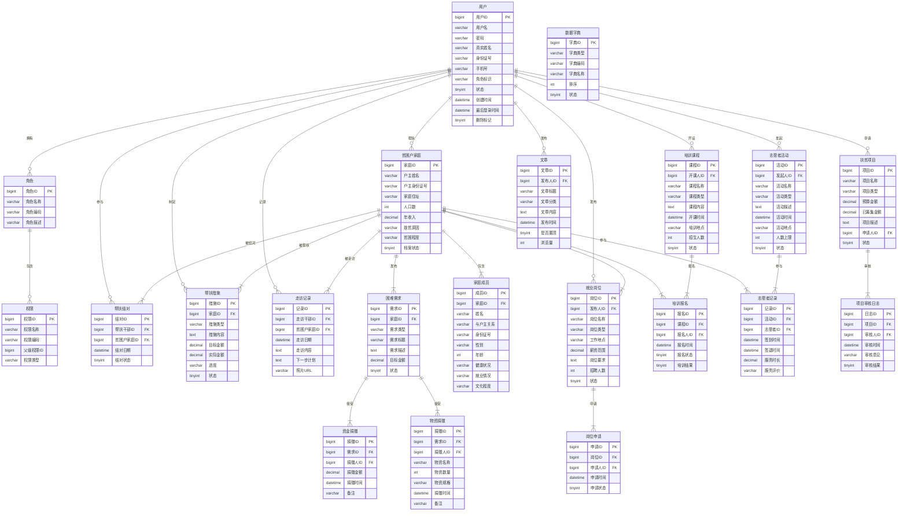

图 3-2 系统核心实体关系图

系统实体间存在多种关系，具体描述如下：

（1）**用户与角色**：用户与角色之间是一对多关系（1:n）。一个用户拥有一个角色，一个角色可被多个用户拥有，用户通过角色标识关联到具体角色。

（2）**角色与权限**：角色与权限之间是一对多关系（1:n）。一个角色包含多个权限，一个权限可被多个角色包含，通过角色权限关联表实现多对多映射。

（3）**用户与贫困户家庭**：用户与贫困户家庭之间是一对多关系（1:n）。一个帮扶责任人可帮扶多个贫困户家庭，一个贫困户家庭只能被一个帮扶责任人帮扶，通过帮扶结对表实现关联。

（4）**用户与帮扶结对**：用户与帮扶结对之间是一对多关系（1:n）。一个用户可参与多个帮扶结对，一个帮扶结对关联一个帮扶干部和一个贫困户家庭。

（5）**用户与帮扶措施**：用户与帮扶措施之间是一对多关系（1:n）。一个帮扶责任人可制定多个帮扶措施，一个帮扶措施由一个帮扶责任人制定。

（6）**用户与走访记录**：用户与走访记录之间是一对多关系（1:n）。一个帮扶责任人可记录多条走访记录，一条走访记录由一个帮扶责任人记录。

（7）**用户与扶贫项目**：用户与扶贫项目之间是一对多关系（1:n）。一个用户可申请多个扶贫项目，一个扶贫项目由一个用户申请。

（8）**用户与就业岗位**：用户与就业岗位之间是一对多关系（1:n）。一个用户可发布多个就业岗位，一个就业岗位由一个用户发布。

（9）**用户与培训课程**：用户与培训课程之间是一对多关系（1:n）。一个用户可开设多个培训课程，一个培训课程由一个用户开设。

（10）**用户与志愿者活动**：用户与志愿者活动之间是一对多关系（1:n）。一个用户可发起多个志愿者活动，一个志愿者活动由一个用户发起。

（11）**用户与文章**：用户与文章之间是一对多关系（1:n）。一个用户可发布多篇文章，一篇文章由一个用户发布。

（12）**贫困户家庭与家庭成员**：贫困户家庭与家庭成员之间是一对多关系（1:n）。一个贫困户家庭包含多个家庭成员，一个家庭成员属于一个贫困户家庭。

（13）**贫困户家庭与帮扶结对**：贫困户家庭与帮扶结对之间是一对多关系（1:n）。一个贫困户家庭可被结对一次，一个帮扶结对关联一个贫困户家庭。

（14）**贫困户家庭与帮扶措施**：贫困户家庭与帮扶措施之间是一对多关系（1:n）。一个贫困户家庭可拥有多个帮扶措施，一个帮扶措施针对一个贫困户家庭。

（15）**贫困户家庭与走访记录**：贫困户家庭与走访记录之间是一对多关系（1:n）。一个贫困户家庭可被走访多次，一条走访记录针对一个贫困户家庭。

（16）**贫困户家庭与困难需求**：贫困户家庭与困难需求之间是一对多关系（1:n）。一个贫困户家庭可发布多个困难需求，一个困难需求由一个贫困户家庭发布。

（17）**贫困户家庭与培训报名**：贫困户家庭与培训报名之间是一对多关系（1:n）。一个贫困户家庭可报名多个培训课程，一条培训报名记录关联一个贫困户家庭。

（18）**贫困户家庭与志愿者记录**：贫困户家庭与志愿者记录之间是一对多关系（1:n）。一个贫困户家庭可接受多次志愿服务，一条志愿者记录关联一个贫困户家庭。

（19）**扶贫项目与项目审核日志**：扶贫项目与项目审核日志之间是一对多关系（1:n）。一个扶贫项目可有多条审核日志，一条审核日志对应一个扶贫项目。

（20）**困难需求与资金捐赠**：困难需求与资金捐赠之间是一对多关系（1:n）。一个困难需求可接受多次资金捐赠，一次资金捐赠对应一个困难需求。

（21）**困难需求与物资捐赠**：困难需求与物资捐赠之间是一对多关系（1:n）。一个困难需求可接受多次物资捐赠，一次物资捐赠对应一个困难需求。

（22）**培训课程与培训报名**：培训课程与培训报名之间是一对多关系（1:n）。一个培训课程可有多个报名记录，一条报名记录对应一个培训课程。

（23）**志愿者活动与志愿者记录**：志愿者活动与志愿者记录之间是一对多关系（1:n）。一个志愿者活动可有多个参与记录，一条志愿者记录对应一个志愿者活动。

（24）**就业岗位与岗位申请**：就业岗位与岗位申请之间是一对多关系（1:n）。一个就业岗位可收到多个申请，一条岗位申请对应一个就业岗位。

(1) 用户实体介绍：用户实体是系统的核心实体，用于存储系统所有用户的基本信息，包括登录账号、密码、真实姓名、身份证号、手机号、角色标识等，支持用户身份认证和权限控制。用户实体属性图如图 3-3 所示。

```
┌───────────────────────────────────────┐
│              用户实体                  │
├───────────────┬───────────────────────┤
│    用户ID(PK) │     用户名             │
├───────────────┼───────────────────────┤
│     密码      │     真实姓名           │
├───────────────┼───────────────────────┤
│    身份证号   │      手机号            │
├───────────────┼───────────────────────┤
│    角色标识   │       状态             │
├───────────────┼───────────────────────┤
│   创建时间    │    最后登录时间         │
├───────────────┴───────────────────────┤
│           删除标记                    │
└───────────────────────────────────────┘
```

图 3-3 用户实体属性图

(2) 角色实体介绍：角色实体用于存储系统的角色信息，定义系统中的角色名称、编码和描述，为基于角色的访问控制提供基础数据。角色实体属性图如图 3-4 所示。

```
┌───────────────────────────────┐
│           角色实体             │
├───────────────┬───────────────┤
│   角色ID(PK)  │    角色名称    │
├───────────────┼───────────────┤
│   角色编码    │    角色描述    │
└───────────────┴───────────────┘
```

图 3-4 角色实体属性图

(3) 权限实体介绍：权限实体用于存储系统的权限信息，包括菜单权限、按钮权限和接口权限，支持细粒度的权限控制。权限实体属性图如图 3-5 所示。

```
┌───────────────────────────────┐
│           权限实体             │
├───────────────┬───────────────┤
│   权限ID(PK)  │    权限名称    │
├───────────────┼───────────────┤
│   权限编码    │   父级权限ID   │
├───────────────┴───────────────┤
│          权限类型             │
└───────────────────────────────┘
```

图 3-5 权限实体属性图

(4) 贫困户家庭实体介绍：贫困户家庭实体用于存储贫困户家庭的基本信息，包括户主信息、家庭住址、人口数、年收入、致贫原因和贫困程度等，是扶贫帮扶工作的核心数据实体。贫困户家庭实体属性图如图 3-6 所示。

```
┌───────────────────────────────────────┐
│          贫困户家庭实体                │
├───────────────┬───────────────────────┤
│   家庭ID(PK)  │     户主姓名          │
├───────────────┼───────────────────────┤
│ 户主身份证号  │     家庭住址           │
├───────────────┼───────────────────────┤
│     人口数    │      年收入            │
├───────────────┼───────────────────────┤
│    致贫原因   │     贫困程度           │
├───────────────┴───────────────────────┤
│          档案状态                     │
└───────────────────────────────────────┘
```

图 3-6 贫困户家庭实体属性图

(5) 家庭成员实体介绍：家庭成员实体用于存储贫困户家庭成员的详细信息，包括姓名、与户主关系、身份证号、性别、年龄、健康状况、就业情况和文化程度等，是贫困户家庭信息的重要补充。家庭成员实体属性图如图 3-7 所示。

```
┌───────────────────────────────────────┐
│          家庭成员实体                  │
├───────────────┬───────────────────────┤
│   成员ID(PK)  │     家庭ID(FK)        │
├───────────────┼───────────────────────┤
│     姓名      │    与户主关系          │
├───────────────┼───────────────────────┤
│    身份证号   │       性别             │
├───────────────┼───────────────────────┤
│     年龄      │     健康状况           │
├───────────────┼───────────────────────┤
│    就业情况   │     文化程度           │
└───────────────┴───────────────────────┘
```

图 3-7 家庭成员实体属性图

(6) 帮扶结对实体介绍：帮扶结对实体用于存储帮扶干部与贫困户家庭的结对关系信息，记录结对日期和结对状态，实现精准帮扶的人员匹配。帮扶结对实体属性图如图 3-8 所示。

```
┌───────────────────────────────┐
│          帮扶结对实体          │
├───────────────┬───────────────┤
│   结对ID(PK)  │  帮扶干部ID(FK)│
├───────────────┼───────────────┤
│ 贫困户家庭ID(FK)│    结对日期    │
├───────────────┴───────────────┤
│          结对状态             │
└───────────────────────────────┘
```

图 3-8 帮扶结对实体属性图

(7) 帮扶措施实体介绍：帮扶措施实体用于存储为贫困户家庭制定的帮扶措施信息，包括措施类型、内容、目标金额、实际金额、进度和状态等，跟踪帮扶工作的实施情况。帮扶措施实体属性图如图 3-9 所示。

```
┌───────────────────────────────────────┐
│          帮扶措施实体                  │
├───────────────┬───────────────────────┤
│   措施ID(PK)  │     家庭ID(FK)        │
├───────────────┼───────────────────────┤
│    措施类型   │     措施内容           │
├───────────────┼───────────────────────┤
│    目标金额   │     实际金额           │
├───────────────┼───────────────────────┤
│     进度      │       状态             │
└───────────────┴───────────────────────┘
```

图 3-9 帮扶措施实体属性图

(8) 走访记录实体介绍：走访记录实体用于存储帮扶干部走访贫困户的记录信息，包括走访日期、内容、下一步计划和照片等，记录帮扶工作的过程和成效。走访记录实体属性图如图 3-10 所示。

```
┌───────────────────────────────────────┐
│          走访记录实体                  │
├───────────────┬───────────────────────┤
│   记录ID(PK)  │   走访干部ID(FK)       │
├───────────────┼───────────────────────┤
│ 贫困户家庭ID(FK)│     走访日期          │
├───────────────┼───────────────────────┤
│    走访内容   │    下一步计划          │
├───────────────┴───────────────────────┤
│          照片URL                     │
└───────────────────────────────────────┘
```

图 3-10 走访记录实体属性图

(9) 扶贫项目实体介绍：扶贫项目实体用于存储扶贫项目的基本信息，包括项目名称、类型、预算金额、已筹集金额、项目描述、申请人和状态等，支持扶贫项目的申报、审核和管理。扶贫项目实体属性图如图 3-11 所示。

```
┌───────────────────────────────────────┐
│          扶贫项目实体                  │
├───────────────┬───────────────────────┤
│   项目ID(PK)  │     项目名称          │
├───────────────┼───────────────────────┤
│    项目类型   │     预算金额           │
├───────────────┼───────────────────────┤
│   已筹集金额  │     项目描述           │
├───────────────┼───────────────────────┤
│   申请人ID(FK)│       状态             │
└───────────────┴───────────────────────┘
```

图 3-11 扶贫项目实体属性图

(10) 项目审核日志实体介绍：项目审核日志实体用于存储扶贫项目的审核记录信息，包括审核人、审核时间、审核意见和审核结果等，记录项目审核的完整过程。项目审核日志实体属性图如图 3-12 所示。

```
┌───────────────────────────────────────┐
│         项目审核日志实体               │
├───────────────┬───────────────────────┤
│   日志ID(PK)  │     项目ID(FK)        │
├───────────────┼───────────────────────┤
│   审核人ID(FK)│     审核时间           │
├───────────────┼───────────────────────┤
│    审核意见   │     审核结果           │
└───────────────┴───────────────────────┘
```

图 3-12 项目审核日志实体属性图

(11) 困难需求实体介绍：困难需求实体用于存储贫困户发布的困难需求信息，包括需求类型、标题、描述、目标金额和状态等，支持贫困户需求的发布和社会力量的帮扶对接。困难需求实体属性图如图 3-13 所示。

```
┌───────────────────────────────────────┐
│          困难需求实体                  │
├───────────────┬───────────────────────┤
│   需求ID(PK)  │     家庭ID(FK)        │
├───────────────┼───────────────────────┤
│    需求类型   │     需求标题           │
├───────────────┼───────────────────────┤
│    需求描述   │     目标金额           │
├───────────────┴───────────────────────┤
│          状态                        │
└───────────────────────────────────────┘
```

图 3-13 困难需求实体属性图

(12) 资金捐赠实体介绍：资金捐赠实体用于存储针对困难需求的资金捐赠信息，包括捐赠人、捐赠金额、捐赠时间和备注等，记录社会力量对贫困户的资金帮扶情况。资金捐赠实体属性图如图 3-14 所示。

```
┌───────────────────────────────────────┐
│          资金捐赠实体                  │
├───────────────┬───────────────────────┤
│   捐赠ID(PK)  │     需求ID(FK)        │
├───────────────┼───────────────────────┤
│   捐赠人ID(FK)│     捐赠金额           │
├───────────────┼───────────────────────┤
│    捐赠时间   │      备注              │
└───────────────┴───────────────────────┘
```

图 3-14 资金捐赠实体属性图

(13) 物资捐赠实体介绍：物资捐赠实体用于存储针对困难需求的物资捐赠信息，包括物资名称、数量、规格、捐赠时间和备注等，记录社会力量对贫困户的物资帮扶情况。物资捐赠实体属性图如图 3-15 所示。

```
┌───────────────────────────────────────┐
│          物资捐赠实体                  │
├───────────────┬───────────────────────┤
│   捐赠ID(PK)  │     需求ID(FK)        │
├───────────────┼───────────────────────┤
│   捐赠人ID(FK)│     物资名称           │
├───────────────┼───────────────────────┤
│    物资数量   │     物资规格           │
├───────────────┼───────────────────────┤
│    捐赠时间   │      备注              │
└───────────────┴───────────────────────┘
```

图 3-15 物资捐赠实体属性图

(14) 就业岗位实体介绍：就业岗位实体用于存储就业帮扶的岗位信息，包括岗位名称、类型、工作地点、薪资范围、岗位要求和招聘人数等，为贫困户提供就业机会。就业岗位实体属性图如图 3-16 所示。

```
┌───────────────────────────────────────┐
│          就业岗位实体                  │
├───────────────┬───────────────────────┤
│   岗位ID(PK)  │   发布人ID(FK)        │
├───────────────┼───────────────────────┤
│    岗位名称   │     岗位类型           │
├───────────────┼───────────────────────┤
│    工作地点   │     薪资范围           │
├───────────────┼───────────────────────┤
│    岗位要求   │     招聘人数           │
├───────────────┴───────────────────────┤
│          状态                        │
└───────────────────────────────────────┘
```

图 3-16 就业岗位实体属性图

(15) 岗位申请实体介绍：岗位申请实体用于存储贫困户的就业岗位申请信息，包括申请时间和申请状态等，记录贫困户的求职过程。岗位申请实体属性图如图 3-17 所示。

```
┌───────────────────────────────────────┐
│          岗位申请实体                  │
├───────────────┬───────────────────────┤
│   申请ID(PK)  │     岗位ID(FK)        │
├───────────────┼───────────────────────┤
│   申请人ID(FK)│     申请时间           │
├───────────────┴───────────────────────┤
│          申请状态                     │
└───────────────────────────────────────┘
```

图 3-17 岗位申请实体属性图

(16) 培训课程实体介绍：培训课程实体用于存储技能培训的课程信息，包括课程名称、类型、内容、开课时间、培训地点和招生人数等，为贫困户提供技能提升机会。培训课程实体属性图如图 3-18 所示。

```
┌───────────────────────────────────────┐
│          培训课程实体                  │
├───────────────┬───────────────────────┤
│   课程ID(PK)  │   开课人ID(FK)        │
├───────────────┼───────────────────────┤
│    课程名称   │     课程类型           │
├───────────────┼───────────────────────┤
│    课程内容   │     开课时间           │
├───────────────┼───────────────────────┤
│    培训地点   │     招生人数           │
├───────────────┴───────────────────────┤
│          状态                        │
└───────────────────────────────────────┘
```

图 3-18 培训课程实体属性图

(17) 培训报名实体介绍：培训报名实体用于存储贫困户的培训报名信息，包括报名时间、报名状态和培训结果等，记录贫困户的培训参与情况。培训报名实体属性图如图 3-19 所示。

```
┌───────────────────────────────────────┐
│          培训报名实体                  │
├───────────────┬───────────────────────┤
│   报名ID(PK)  │     课程ID(FK)        │
├───────────────┼───────────────────────┤
│   报名人ID(FK)│     报名时间           │
├───────────────┼───────────────────────┤
│    报名状态   │     培训结果           │
└───────────────┴───────────────────────┘
```

图 3-19 培训报名实体属性图

(18) 志愿者活动实体介绍：志愿者活动实体用于存储志愿者服务活动的信息，包括活动名称、类型、描述、活动时间、地点和人数上限等，支持志愿者服务的组织和管理。志愿者活动实体属性图如图 3-20 所示。

```
┌───────────────────────────────────────┐
│          志愿者活动实体                │
├───────────────┬───────────────────────┤
│   活动ID(PK)  │   发起人ID(FK)        │
├───────────────┼───────────────────────┤
│    活动名称   │     活动类型           │
├───────────────┼───────────────────────┤
│    活动描述   │     活动时间           │
├───────────────┼───────────────────────┤
│    活动地点   │     人数上限           │
├───────────────┴───────────────────────┤
│          状态                        │
└───────────────────────────────────────┘
```

图 3-20 志愿者活动实体属性图

(19) 志愿者记录实体介绍：志愿者记录实体用于存储志愿者参与活动的记录信息，包括签到时间、签退时间、服务时长和服务评价等，记录志愿者的服务情况。志愿者记录实体属性图如图 3-21 所示。

```
┌───────────────────────────────────────┐
│          志愿者记录实体                │
├───────────────┬───────────────────────┤
│   记录ID(PK)  │     活动ID(FK)        │
├───────────────┼───────────────────────┤
│   志愿者ID(FK)│     签到时间           │
├───────────────┼───────────────────────┤
│    签退时间   │     服务时长           │
├───────────────┴───────────────────────┤
│          服务评价                     │
└───────────────────────────────────────┘
```

图 3-21 志愿者记录实体属性图

(20) 文章实体介绍：文章实体用于存储信息公开模块的文章内容，包括文章标题、分类、内容、发布时间、置顶状态和浏览量等，支持政策新闻、通知公告和脱贫案例的发布。文章实体属性图如图 3-22 所示。

```
┌───────────────────────────────────────┐
│           文章实体                    │
├───────────────┬───────────────────────┤
│   文章ID(PK)  │   发布人ID(FK)        │
├───────────────┼───────────────────────┤
│    文章标题   │     文章分类           │
├───────────────┼───────────────────────┤
│    文章内容   │     发布时间           │
├───────────────┼───────────────────────┤
│   是否置顶    │      浏览量            │
└───────────────┴───────────────────────┘
```

图 3-22 文章实体属性图

(21) 数据字典实体介绍：数据字典实体用于存储系统的基础配置数据，包括字典类型、编码、名称和排序等，为系统提供统一的基础数据管理。数据字典实体属性图如图 3-23 所示。

```
┌───────────────────────────────────────┐
│          数据字典实体                  │
├───────────────┬───────────────────────┤
│   字典ID(PK)  │     字典类型          │
├───────────────┼───────────────────────┤
│    字典编码   │     字典名称           │
├───────────────┼───────────────────────┤
│     排序      │       状态             │
└───────────────┴───────────────────────┘
```

图 3-23 数据字典实体属性图

#### 3.2.2 数据库表设计

系统共设计 22 张数据库表，涵盖系统权限管理和业务数据管理两大领域，各表字段名称与实体属性一一对应，确保数据一致性与完整性。

(1) 系统用户表用于存储系统所有用户的基本信息，包括登录账号、密码、真实姓名、身份证号、手机号、角色标识等，支持用户的身份认证和权限控制。系统用户表如表 3-1 所示。

表 3-1 系统用户表（sys\_user）

| 字段名称         | 数据类型     | 字段长度 | 主键 | 允许null值 | 描述                               |
| :----------- | :------- | :--- | :- | :------ | :------------------------------- |
| user\_id     | BIGINT   | 20   | 是  | 否       | 用户ID，自增主键                        |
| username     | VARCHAR  | 50   | 否  | 否       | 登录用户名，唯一                         |
| password     | VARCHAR  | 255  | 否  | 否       | 密码，BCrypt加密存储                    |
| real\_name   | VARCHAR  | 50   | 否  | 是       | 真实姓名                             |
| id\_card     | VARCHAR  | 18   | 否  | 是       | 身份证号，唯一                          |
| phone        | VARCHAR  | 20   | 否  | 是       | 手机号                              |
| role\_code   | VARCHAR  | 30   | 否  | 否       | 角色标识（poor/cadre/volunteer/admin） |
| status       | TINYINT  | 1    | 否  | 是       | 状态，默认1（0-禁用，1-正常）                |
| create\_time | DATETIME | -    | 否  | 是       | 注册时间，默认当前时间                      |
| last\_login  | DATETIME | -    | 否  | 是       | 最后登录时间                           |
| deleted      | TINYINT  | 1    | 否  | 是       | 逻辑删除标记，默认0（0-未删，1-已删）            |

(2) 角色表用于存储系统的角色信息，定义系统中的角色名称、编码和描述，为基于角色的访问控制提供基础数据。角色表如表 3-2 所示。

表 3-2 角色表（sys\_role）

| 字段名称        | 数据类型    | 字段长度 | 主键 | 允许null值 | 描述        |
| :---------- | :------ | :--- | :- | :------ | :-------- |
| role\_id    | BIGINT  | 20   | 是  | 否       | 角色ID，自增主键 |
| role\_name  | VARCHAR | 50   | 否  | 否       | 角色名称      |
| role\_code  | VARCHAR | 50   | 否  | 否       | 角色编码，唯一   |
| description | VARCHAR | 200  | 否  | 是       | 角色描述      |

(3) 权限表用于存储系统的权限信息，包括菜单权限、按钮权限和接口权限，支持权限的层级管理和细粒度控制。权限表如表 3-3 所示。

表 3-3 权限表（sys\_permission）

| 字段名称       | 数据类型    | 字段长度 | 主键 | 允许null值 | 描述                    |
| :--------- | :------ | :--- | :- | :------ | :-------------------- |
| perm\_id   | BIGINT  | 20   | 是  | 否       | 权限ID，自增主键             |
| perm\_name | VARCHAR | 50   | 否  | 否       | 权限名称                  |
| perm\_code | VARCHAR | 100  | 否  | 否       | 权限编码，如sys:user:add，唯一 |
| parent\_id | BIGINT  | 20   | 否  | 是       | 父级权限ID                |
| type       | TINYINT | 1    | 否  | 是       | 权限类型（1-菜单，2-按钮，3-接口）  |

(4) 贫困户家庭档案表用于存储贫困户家庭的基本信息，包括户主信息、家庭住址、人口数、年收入、致贫原因、贫困程度等，是系统的核心业务数据表之一。贫困户家庭档案表如表 3-4 所示。

表 3-4 贫困户家庭档案表（poverty\_family）

| 字段名称                 | 数据类型     | 字段长度 | 主键 | 允许null值 | 描述                      |
| :------------------- | :------- | :--- | :- | :------ | :---------------------- |
| family\_id           | BIGINT   | 20   | 是  | 否       | 家庭ID，自增主键               |
| family\_code         | VARCHAR  | 50   | 否  | 是       | 家庭档案编号                  |
| householder\_id      | BIGINT   | 20   | 否  | 是       | 户主用户ID，关联sys\_user表     |
| householder\_name    | VARCHAR  | 50   | 否  | 否       | 户主姓名                    |
| id\_card             | VARCHAR  | 18   | 否  | 是       | 户主身份证号                  |
| province             | VARCHAR  | 50   | 否  | 是       | 省                       |
| city                 | VARCHAR  | 50   | 否  | 是       | 市                       |
| district             | VARCHAR  | 50   | 否  | 是       | 区/县                     |
| town                 | VARCHAR  | 50   | 否  | 是       | 镇/乡                     |
| village              | VARCHAR  | 50   | 否  | 是       | 村                       |
| address              | VARCHAR  | 200  | 否  | 是       | 详细地址                    |
| family\_size         | INT      | 3    | 否  | 是       | 家庭人口数                   |
| annual\_income       | DECIMAL  | 12,2 | 否  | 是       | 年收入（元）                  |
| poverty\_cause\_code | VARCHAR  | 50   | 否  | 是       | 致贫原因编码                  |
| poverty\_level       | VARCHAR  | 20   | 否  | 是       | 贫困程度                    |
| status               | VARCHAR  | 20   | 否  | 是       | 档案状态，默认"建档"（建档/已脱贫/已返贫） |
| filing\_date         | DATE     | -    | 否  | 是       | 建档日期                    |
| create\_time         | DATETIME | -    | 否  | 是       | 创建时间，默认当前时间             |
| update\_time         | DATETIME | -    | 否  | 是       | 更新时间，自动更新               |

(5) 家庭成员表用于存储贫困户家庭成员的详细信息，包括姓名、与户主关系、身份证号、性别、年龄、健康状况、就业情况和文化程度等，实现对贫困户家庭人口的全面管理。家庭成员表如表 3-5 所示。

表 3-5 家庭成员表（family\_member）

| 字段名称           | 数据类型    | 字段长度 | 主键 | 允许null值 | 描述                      |
| :------------- | :------ | :--- | :- | :------ | :---------------------- |
| member\_id     | BIGINT  | 20   | 是  | 否       | 成员ID，自增主键               |
| family\_id     | BIGINT  | 20   | 否  | 否       | 家庭ID，关联poverty\_family表 |
| name           | VARCHAR | 50   | 否  | 否       | 姓名                      |
| relationship   | VARCHAR | 20   | 否  | 是       | 与户主关系                   |
| id\_card       | VARCHAR | 18   | 否  | 是       | 身份证号                    |
| phone          | VARCHAR | 20   | 否  | 是       | 手机号                     |
| gender         | VARCHAR | 10   | 否  | 是       | 性别                      |
| age            | INT     | 3    | 否  | 是       | 年龄                      |
| health\_status | VARCHAR | 50   | 否  | 是       | 健康状况                    |
| has\_job       | TINYINT | 1    | 否  | 是       | 是否有工作，默认0（0-无，1-有）      |
| education      | VARCHAR | 20   | 否  | 是       | 文化程度                    |
| remarks        | VARCHAR | 500  | 否  | 是       | 备注                      |

(6) 帮扶结对表用于存储帮扶干部与贫困户家庭的结对关系信息，记录结对日期、结束日期和结对状态，是实现"一对一"精准帮扶的基础。帮扶结对表如表 3-6 所示。

表 3-6 帮扶结对表（assistance\_pairing）

| 字段名称            | 数据类型    | 字段长度 | 主键 | 允许null值 | 描述                      |
| :-------------- | :------ | :--- | :- | :------ | :---------------------- |
| pairing\_id     | BIGINT  | 20   | 是  | 否       | 结对ID，自增主键               |
| cadre\_user\_id | BIGINT  | 20   | 否  | 否       | 帮扶干部用户ID，关联sys\_user表   |
| family\_id      | BIGINT  | 20   | 否  | 否       | 家庭ID，关联poverty\_family表 |
| pair\_date      | DATE    | -    | 否  | 是       | 结对日期                    |
| end\_date       | DATE    | -    | 否  | 是       | 结束日期                    |
| status          | VARCHAR | 10   | 否  | 是       | 结对状态，默认"1"（0-已结束，1-结对中） |
| remark          | VARCHAR | 500  | 否  | 是       | 备注                      |

(7) 帮扶措施表用于存储为贫困户家庭制定的帮扶措施信息，包括措施类型、内容、目标金额、实际金额、进度和状态等，支持"一户一策"的精准帮扶管理。帮扶措施表如表 3-7 所示。

表 3-7 帮扶措施表（assistance\_measure）

| 字段名称           | 数据类型     | 字段长度 | 主键 | 允许null值 | 描述                                |
| :------------- | :------- | :--- | :- | :------ | :-------------------------------- |
| measure\_id    | BIGINT   | 20   | 是  | 否       | 措施ID，自增主键                         |
| pairing\_id    | BIGINT   | 20   | 否  | 是       | 结对ID，关联assistance\_pairing表       |
| family\_id     | BIGINT   | 20   | 否  | 否       | 家庭ID，关联poverty\_family表           |
| measure\_type  | VARCHAR  | 50   | 否  | 是       | 措施类型（产业/教育/医疗等）                   |
| content        | TEXT     | -    | 否  | 是       | 措施内容                              |
| target\_amount | DECIMAL  | 12,2 | 否  | 是       | 目标金额                              |
| actual\_amount | DECIMAL  | 12,2 | 否  | 是       | 实际金额                              |
| progress       | INT      | 3    | 否  | 是       | 进度百分比（0-100），默认0                  |
| status         | VARCHAR  | 10   | 否  | 是       | 状态，默认"0"（0-未启动，1-进行中，2-已完成，3-已取消） |
| create\_time   | DATETIME | -    | 否  | 是       | 创建时间，默认当前时间                       |
| update\_time   | DATETIME | -    | 否  | 是       | 更新时间，自动更新                         |

(8) 走访记录表用于存储帮扶干部走访贫困户的记录信息，包括走访日期、内容、下一步计划和照片等，为帮扶工作提供过程性证据，便于上级部门监督检查。走访记录表如表 3-8 所示。

表 3-8 走访记录表（visit\_record）

| 字段名称            | 数据类型     | 字段长度 | 主键 | 允许null值 | 描述                        |
| :-------------- | :------- | :--- | :- | :------ | :------------------------ |
| record\_id      | BIGINT   | 20   | 是  | 否       | 记录ID，自增主键                 |
| cadre\_user\_id | BIGINT   | 20   | 否  | 否       | 走访干部用户ID，关联sys\_user表     |
| family\_id      | BIGINT   | 20   | 否  | 否       | 走访家庭ID，关联poverty\_family表 |
| visit\_date     | DATE     | -    | 否  | 是       | 走访日期                      |
| content         | TEXT     | -    | 否  | 是       | 走访内容                      |
| photos          | VARCHAR  | 2000 | 否  | 是       | 照片URL（JSON数组）             |
| next\_plan      | TEXT     | -    | 否  | 是       | 下一步帮扶计划                   |
| create\_time    | DATETIME | -    | 否  | 是       | 创建时间，默认当前时间               |

(9) 扶贫项目表用于存储扶贫项目的基本信息，包括项目名称、预算、已筹集金额、描述和状态等，支持项目从申请到完成的全流程管理。扶贫项目表如表 3-9 所示。

表 3-9 扶贫项目表（poverty\_project）

| 字段名称           | 数据类型     | 字段长度 | 主键 | 允许null值 | 描述                                      |
| :------------- | :------- | :--- | :- | :------ | :-------------------------------------- |
| project\_id    | BIGINT   | 20   | 是  | 否       | 项目ID，自增主键                               |
| project\_name  | VARCHAR  | 200  | 否  | 否       | 项目名称                                    |
| family\_id     | BIGINT   | 20   | 否  | 是       | 关联家庭ID，关联poverty\_family表               |
| proposer\_id   | BIGINT   | 20   | 否  | 否       | 申请人ID（帮扶干部），关联sys\_user表                |
| budget         | DECIMAL  | 12,2 | 否  | 是       | 项目预算                                    |
| raised\_amount | DECIMAL  | 12,2 | 否  | 是       | 已筹集金额，默认0.00                            |
| description    | TEXT     | -    | 否  | 是       | 项目描述                                    |
| status         | VARCHAR  | 20   | 否  | 是       | 状态，默认"0"（0-待审核，1-已通过，2-已驳回，3-进行中，4-已完成） |
| create\_time   | DATETIME | -    | 否  | 是       | 创建时间，默认当前时间                             |
| update\_time   | DATETIME | -    | 否  | 是       | 更新时间，自动更新                               |

(10) 困难需求发布表用于存储贫困户发布的困难需求信息，包括需求类型、标题、描述、目标金额和状态等，实现贫困户需求与社会资源的精准对接。困难需求发布表如表 3-10 所示。

表 3-10 困难需求发布表（needs\_publish）

| 字段名称           | 数据类型     | 字段长度 | 主键 | 允许null值 | 描述                          |
| :------------- | :------- | :--- | :- | :------ | :-------------------------- |
| need\_id       | BIGINT   | 20   | 是  | 否       | 需求ID，自增主键                   |
| family\_id     | BIGINT   | 20   | 否  | 否       | 家庭ID，关联poverty\_family表     |
| publisher\_id  | BIGINT   | 20   | 否  | 否       | 发布人ID，关联sys\_user表          |
| need\_type     | VARCHAR  | 20   | 否  | 是       | 需求类型（资金/物资/技术/其他）           |
| title          | VARCHAR  | 200  | 否  | 否       | 需求标题                        |
| description    | TEXT     | -    | 否  | 是       | 需求描述                        |
| target\_amount | DECIMAL  | 12,2 | 否  | 是       | 目标金额/价值                     |
| actual\_amount | DECIMAL  | 12,2 | 否  | 是       | 已获金额/价值，默认0.00              |
| status         | VARCHAR  | 10   | 否  | 是       | 状态，默认"0"（0-待解决，1-已对接，2-已完成） |
| create\_time   | DATETIME | -    | 否  | 是       | 创建时间，默认当前时间                 |
| update\_time   | DATETIME | -    | 否  | 是       | 更新时间，自动更新                   |

(11) 用户角色关联表用于建立用户与角色之间的多对多关系，实现用户的角色分配和基于角色的访问控制。用户角色关联表如表 3-11 所示。

表 3-11 用户角色关联表（sys\_user\_role）

| 字段名称         | 数据类型     | 字段长度 | 主键 | 允许null值 | 描述                |
| :----------- | :------- | :--- | :- | :------ | :---------------- |
| id           | BIGINT   | 20   | 是  | 否       | 关联ID，自增主键         |
| user\_id     | BIGINT   | 20   | 否  | 否       | 用户ID，关联sys\_user表 |
| role\_id     | BIGINT   | 20   | 否  | 否       | 角色ID，关联sys\_role表 |
| create\_time | DATETIME | -    | 否  | 是       | 创建时间，默认当前时间       |

(12) 角色权限关联表用于建立角色与权限之间的多对多关系，实现角色的权限配置和细粒度的访问控制。角色权限关联表如表 3-12 所示。

表 3-12 角色权限关联表（sys\_role\_permission）

| 字段名称         | 数据类型     | 字段长度 | 主键 | 允许null值 | 描述                      |
| :----------- | :------- | :--- | :- | :------ | :---------------------- |
| id           | BIGINT   | 20   | 是  | 否       | 关联ID，自增主键               |
| role\_id     | BIGINT   | 20   | 否  | 否       | 角色ID，关联sys\_role表       |
| perm\_id     | BIGINT   | 20   | 否  | 否       | 权限ID，关联sys\_permission表 |
| create\_time | DATETIME | -    | 否  | 是       | 创建时间，默认当前时间             |

(13) 项目审核日志表用于记录扶贫项目的审核过程，包括审核人、审核操作和审核意见，实现项目审核的可追溯和审计。项目审核日志表如表 3-13 所示。

表 3-13 项目审核日志表（project\_audit\_log）

| 字段名称         | 数据类型     | 字段长度 | 主键 | 允许null值 | 描述                       |
| :----------- | :------- | :--- | :- | :------ | :----------------------- |
| log\_id      | BIGINT   | 20   | 是  | 否       | 日志ID，自增主键                |
| project\_id  | BIGINT   | 20   | 否  | 否       | 项目ID，关联poverty\_project表 |
| auditor\_id  | BIGINT   | 20   | 否  | 否       | 审核人ID，关联sys\_user表       |
| action       | VARCHAR  | 50   | 否  | 否       | 操作（审核通过/驳回/提交等）          |
| comment      | VARCHAR  | 500  | 否  | 是       | 审核意见                     |
| create\_time | DATETIME | -    | 否  | 是       | 创建时间，默认当前时间              |

(14) 资金捐赠表用于记录社会各界的资金捐赠信息，包括捐赠人、捐赠金额、支付方式和捐赠状态等，支持匿名捐赠和定向捐赠。资金捐赠表如表 3-14 所示。

表 3-14 资金捐赠表（donation\_money）

| 字段名称                | 数据类型     | 字段长度 | 主键 | 允许null值 | 描述                         |
| :------------------ | :------- | :--- | :- | :------ | :------------------------- |
| money\_donation\_id | BIGINT   | 20   | 是  | 否       | 捐赠ID，自增主键                  |
| donor\_name         | VARCHAR  | 50   | 否  | 否       | 捐赠人姓名                      |
| amount              | DECIMAL  | 12,2 | 否  | 否       | 捐赠金额                       |
| payment\_method     | VARCHAR  | 50   | 否  | 是       | 支付方式                       |
| transaction\_id     | VARCHAR  | 100  | 否  | 是       | 支付流水号                      |
| recorder\_id        | BIGINT   | 20   | 否  | 否       | 登记人ID，关联sys\_user表         |
| status              | TINYINT  | 1    | 否  | 是       | 状态，默认0（0-待确认，1-已到账）        |
| need\_id            | BIGINT   | 20   | 否  | 是       | 关联需求ID，关联needs\_publish表   |
| project\_id         | BIGINT   | 20   | 否  | 是       | 关联项目ID，关联poverty\_project表 |
| donate\_time        | DATETIME | -    | 否  | 是       | 捐赠时间                       |
| is\_anonymous       | TINYINT  | 1    | 否  | 是       | 是否匿名，默认0（0-否，1-是）          |

(15) 物资捐赠表用于记录社会各界的物资捐赠信息，包括捐赠人、物资名称、数量、单位和发放状态等，支持物资的接收、发放和反馈全流程管理。物资捐赠表如表 3-15 所示。

表 3-15 物资捐赠表（donation\_goods）

| 字段名称                | 数据类型     | 字段长度 | 主键 | 允许null值 | 描述                         |
| :------------------ | :------- | :--- | :- | :------ | :------------------------- |
| goods\_donation\_id | BIGINT   | 20   | 是  | 否       | 捐赠ID，自增主键                  |
| donor\_name         | VARCHAR  | 50   | 否  | 否       | 捐赠人/单位                     |
| goods\_name         | VARCHAR  | 100  | 否  | 否       | 物资名称                       |
| quantity            | INT      | 10   | 否  | 否       | 数量                         |
| unit                | VARCHAR  | 20   | 否  | 是       | 单位                         |
| need\_id            | BIGINT   | 20   | 否  | 是       | 关联需求ID，关联needs\_publish表   |
| logistics\_info     | VARCHAR  | 200  | 否  | 是       | 物流/发放信息                    |
| recorder\_id        | BIGINT   | 20   | 否  | 否       | 登记人ID，关联sys\_user表         |
| receive\_family\_id | BIGINT   | 20   | 否  | 是       | 接收贫困户ID，关联poverty\_family表 |
| status              | TINYINT  | 1    | 否  | 是       | 状态，默认1（1-已接收，2-已发放，3-已反馈）  |
| donate\_time        | DATETIME | -    | 否  | 是       | 捐赠时间                       |

(16) 就业岗位表用于存储就业岗位的发布信息，包括岗位名称、招聘单位、岗位要求、薪资范围和工作地点等，为贫困户提供就业信息服务，促进脱贫增收。就业岗位表如表 3-16 所示。

表 3-16 就业岗位表（job\_position）

| 字段名称          | 数据类型     | 字段长度 | 主键 | 允许null值 | 描述                 |
| :------------ | :------- | :--- | :- | :------ | :----------------- |
| job\_id       | BIGINT   | 20   | 是  | 否       | 岗位ID，自增主键          |
| publisher\_id | BIGINT   | 20   | 否  | 否       | 发布人ID，关联sys\_user表 |
| title         | VARCHAR  | 100  | 否  | 否       | 岗位名称               |
| company       | VARCHAR  | 100  | 否  | 是       | 招聘单位               |
| requirements  | TEXT     | -    | 否  | 是       | 岗位要求               |
| salary\_range | VARCHAR  | 50   | 否  | 是       | 薪资范围               |
| workplace     | VARCHAR  | 200  | 否  | 是       | 工作地点               |
| contact       | VARCHAR  | 100  | 否  | 是       | 联系方式               |
| is\_valid     | TINYINT  | 1    | 否  | 是       | 状态，默认1（1-有效，0-下架）  |
| publish\_time | DATETIME | -    | 否  | 是       | 发布时间               |

(17) 岗位申请表用于存储贫困户申请就业岗位的记录信息，包括申请状态和备注等，实现岗位申请的跟踪管理。岗位申请表如表 3-17 所示。

表 3-17 岗位申请表（job\_application）

| 字段名称                | 数据类型     | 字段长度 | 主键 | 允许null值 | 描述                      |
| :------------------ | :------- | :--- | :- | :------ | :---------------------- |
| apply\_id           | BIGINT   | 20   | 是  | 否       | 申请ID，自增主键               |
| job\_id             | BIGINT   | 20   | 否  | 否       | 岗位ID，关联job\_position表   |
| applicant\_user\_id | BIGINT   | 20   | 否  | 否       | 申请人用户ID，关联sys\_user表    |
| apply\_status       | TINYINT  | 1    | 否  | 是       | 状态，默认1（1-申请中，2-通过，3-拒绝） |
| remark              | VARCHAR  | 500  | 否  | 是       | 备注                      |
| apply\_time         | DATETIME | -    | 否  | 是       | 申请时间，默认当前时间             |

(18) 培训课程表用于存储技能培训课程的发布信息，包括课程标题、内容、讲师、时间、地点和报名人数等，支持培训课程的管理和报名。培训课程表如表 3-18 所示。

表 3-18 培训课程表（training\_course）

| 字段名称            | 数据类型     | 字段长度 | 主键 | 允许null值 | 描述                             |
| :-------------- | :------- | :--- | :- | :------ | :----------------------------- |
| course\_id      | BIGINT   | 20   | 是  | 否       | 课程ID，自增主键                      |
| title           | VARCHAR  | 200  | 否  | 否       | 课程标题                           |
| content         | TEXT     | -    | 否  | 是       | 课程内容                           |
| trainer         | VARCHAR  | 50   | 否  | 是       | 培训讲师                           |
| start\_time     | DATETIME | -    | 否  | 是       | 开始时间                           |
| end\_time       | DATETIME | -    | 否  | 是       | 结束时间                           |
| location        | VARCHAR  | 200  | 否  | 是       | 培训地点（可填线上链接）                   |
| max\_enroll     | INT      | 10   | 否  | 是       | 最大报名人数                         |
| enrolled\_count | INT      | 10   | 否  | 是       | 已报名人数，默认0                      |
| status          | TINYINT  | 1    | 否  | 是       | 状态，默认1（1-预告，2-报名中，3-进行中，4-已结束） |
| publisher\_id   | BIGINT   | 20   | 否  | 否       | 发布人ID，关联sys\_user表             |

(19) 培训报名表用于存储贫困户报名参加培训课程的记录信息，包括签到时间和报名状态，实现培训报名和签到的管理。培训报名表如表 3-19 所示。

表 3-19 培训报名表（training\_enrollment）

| 字段名称           | 数据类型     | 字段长度 | 主键 | 允许null值 | 描述                       |
| :------------- | :------- | :--- | :- | :------ | :----------------------- |
| enroll\_id     | BIGINT   | 20   | 是  | 否       | 报名ID，自增主键                |
| course\_id     | BIGINT   | 20   | 否  | 否       | 课程ID，关联training\_course表 |
| user\_id       | BIGINT   | 20   | 否  | 否       | 报名用户ID，关联sys\_user表      |
| sign\_in\_time | DATETIME | -    | 否  | 是       | 签到时间                     |
| status         | TINYINT  | 1    | 否  | 是       | 状态，默认1（1-已报名，2-已签到，3-缺勤） |
| enroll\_time   | DATETIME | -    | 否  | 是       | 报名时间，默认当前时间              |

(20) 志愿者活动表用于存储志愿者活动的发布信息，包括活动标题、描述、时间、地点和需要人数等，支持志愿者活动的组织和管理。志愿者活动表如表 3-20 所示。

表 3-20 志愿者活动表（volunteer\_activity）

| 字段名称              | 数据类型     | 字段长度 | 主键 | 允许null值 | 描述                   |
| :---------------- | :------- | :--- | :- | :------ | :------------------- |
| activity\_id      | BIGINT   | 20   | 是  | 否       | 活动ID，自增主键            |
| title             | VARCHAR  | 200  | 否  | 否       | 活动标题                 |
| description       | TEXT     | -    | 否  | 是       | 活动描述                 |
| start\_time       | DATETIME | -    | 否  | 是       | 开始时间                 |
| end\_time         | DATETIME | -    | 否  | 是       | 结束时间                 |
| location          | VARCHAR  | 200  | 否  | 是       | 活动地点                 |
| organizer\_id     | BIGINT   | 20   | 否  | 否       | 组织者用户ID，关联sys\_user表 |
| need\_volunteers  | INT      | 10   | 否  | 是       | 需要人数                 |
| registered\_count | INT      | 10   | 否  | 是       | 已报名人数，默认0            |
| create\_time      | DATETIME | -    | 否  | 是       | 创建时间，默认当前时间          |

(21) 志愿者活动报名/服务记录表用于存储志愿者报名参加活动和服务的记录信息，包括签到签退时间和服务时长，实现志愿者服务的统计和管理。志愿者活动报名/服务记录表如表 3-21 所示。

表 3-21 志愿者活动报名/服务记录表（volunteer\_record）

| 字段名称                | 数据类型     | 字段长度 | 主键 | 允许null值 | 描述                          |
| :------------------ | :------- | :--- | :- | :------ | :-------------------------- |
| record\_id          | BIGINT   | 20   | 是  | 否       | 记录ID，自增主键                   |
| activity\_id        | BIGINT   | 20   | 否  | 否       | 活动ID，关联volunteer\_activity表 |
| volunteer\_user\_id | BIGINT   | 20   | 否  | 否       | 志愿者用户ID，关联sys\_user表        |
| sign\_in\_time      | DATETIME | -    | 否  | 是       | 签到时间                        |
| sign\_out\_time     | DATETIME | -    | 否  | 是       | 签退时间                        |
| service\_hours      | DECIMAL  | 5,2  | 否  | 是       | 服务时长（小时）                    |
| status              | TINYINT  | 1    | 否  | 是       | 状态，默认1（1-已报名，2-已签到，3-已完成）   |

(22) 文章/公告表用于存储政策新闻、通知公告、脱贫案例和捐赠公示等信息，支持信息的发布、浏览和管理，保障信息透明和政策宣传。文章/公告表如表 3-22 所示。

表 3-22 文章/公告表（news\_article）

| 字段名称          | 数据类型     | 字段长度 | 主键 | 允许null值 | 描述                      |
| :------------ | :------- | :--- | :- | :------ | :---------------------- |
| article\_id   | BIGINT   | 20   | 是  | 否       | 文章ID，自增主键               |
| title         | VARCHAR  | 200  | 否  | 否       | 文章标题                    |
| content       | TEXT     | -    | 否  | 是       | 文章内容                    |
| type          | VARCHAR  | 50   | 否  | 是       | 类型（政策新闻/脱贫案例/通知公告/捐赠公示） |
| publisher\_id | BIGINT   | 20   | 否  | 否       | 发布人ID，关联sys\_user表      |
| view\_count   | INT      | 10   | 否  | 是       | 浏览次数，默认0                |
| is\_top       | TINYINT  | 1    | 否  | 是       | 是否置顶，默认0（0-否，1-是）       |
| status        | TINYINT  | 1    | 否  | 是       | 状态，默认0（0-草稿，1-已发布）      |
| create\_time  | DATETIME | -    | 否  | 是       | 创建时间，默认当前时间             |
| update\_time  | DATETIME | -    | 否  | 是       | 更新时间，自动更新               |

### 3.3 本章小结

本章对扶贫帮扶管理系统进行了总体设计，包括系统功能结构设计和数据库设计。系统功能结构设计划分了 12 个功能模块，各模块职责明确、相互协作。数据库设计包括数据库概念设计和数据库表设计，共设计了 22 张数据库表，建立了完整的数据模型。本章的设计为系统的详细实现提供了蓝图和基础。

***

## 第4章 系统详细设计与实现

本章需对系统各功能模块进行详细设计，明确模块内部逻辑与实现方式。应包含主要功能的流程图、时序图，清晰描述操作步骤与交互过程；同时提供关键界面的实现效果图，直观展示系统运行效果。设计内容应具备可实施性，体现技术细节与用户交互逻辑，为后续开发与测试提供依据。本章将依次对贫困户档案管理、帮扶结对管理、走访记录管理、扶贫项目管理、困难需求与捐赠管理、就业帮扶、技能培训、志愿服务、信息公开等核心模块进行详细设计，每个模块均包含功能结构、流程设计、时序设计和界面设计。

### 4.1 贫困户档案管理模块

#### 4.1.1 原理介绍

贫困户档案管理模块是系统的核心基础模块，主要负责贫困户家庭信息的建档、维护和管理。该模块采用"一户一档"的管理模式，通过对家庭基本信息、户主信息、家庭成员信息、致贫原因、收入情况等数据的统一管理，实现对贫困户的精准识别和动态跟踪。模块支持档案的新增、编辑、查询和删除操作，并提供家庭成员的批量管理功能，确保扶贫工作有章可循、有据可查。

#### 4.1.2 模块功能时序图

贫困户档案管理模块的时序图描述了用户与系统之间的交互过程，包括档案新增和档案管理等核心操作。模块功能时序图如图 4-1 所示。

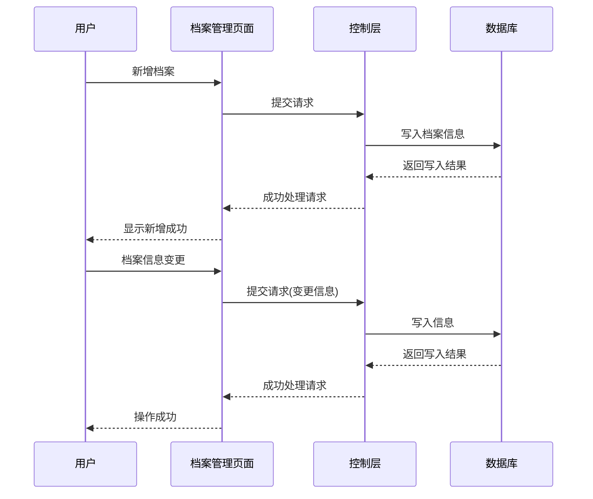

图 4-1 贫困户档案管理模块功能时序图

#### 4.1.3 工作流程

贫困户档案管理模块的工作流程如下：

（1）用户登录系统后，进入档案管理页面，系统默认展示所有贫困户档案列表，支持按户主姓名、身份证号、档案状态等条件进行搜索和筛选。

（2）新增档案时，用户填写户主信息、家庭住址、人口数、年收入、致贫原因等必填项，可选择性添加家庭成员信息。提交后，系统验证数据合法性，保存到数据库并生成唯一的档案编号。

（3）编辑档案时，用户点击编辑按钮，系统加载档案详情并预填到表单中，用户修改后提交，系统更新数据库中的记录。

（4）删除档案时，系统采用逻辑删除机制，仅标记档案为已删除状态，保留历史数据以便追溯。

（5）查看档案详情时，系统展示完整的家庭信息和家庭成员列表，便于全面了解贫困户情况。

#### 4.1.4 模块流程图

贫困户档案管理模块的流程图描述了档案管理的完整业务流程。模块流程图如图 4-2 所示。

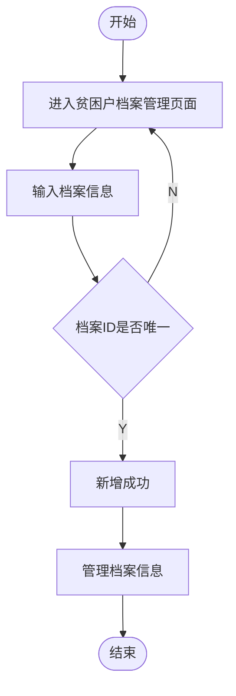

图 4-2 贫困户档案管理模块流程图

#### 4.1.5 功能实现

**（1）后端实现**

后端实现分为 Controller、Service 和 Mapper 三层：

**Controller 层**：`FamilyController` 类负责接收前端请求，进行参数校验，调用 Service 层处理业务，返回统一格式的响应结果。

```java
@RestController
@RequestMapping("/api/v1/poverty/family")
public class FamilyController {
    
    @Autowired
    private FamilyService familyService;
    
    @GetMapping("/list")
    public R<Page<FamilyVO>> list(FamilyQuery query) {
        Page<FamilyVO> page = familyService.pageList(query);
        return R.ok(page);
    }
    
    @GetMapping("/{id}")
    public R<FamilyVO> detail(@PathVariable Long id) {
        FamilyVO detail = familyService.getDetail(id);
        return R.ok(detail);
    }
    
    @PostMapping
    public R<Void> add(@RequestBody FamilyDTO dto) {
        familyService.add(dto);
        return R.ok();
    }
    
    @PutMapping("/{id}")
    public R<Void> update(@PathVariable Long id, @RequestBody FamilyDTO dto) {
        familyService.update(id, dto);
        return R.ok();
    }
    
    @DeleteMapping("/{id}")
    public R<Void> delete(@PathVariable Long id) {
        familyService.delete(id);
        return R.ok();
    }
}
```

**Service 层**：`FamilyService` 接口及其实现类 `FamilyServiceImpl` 封装业务逻辑，调用 Mapper 层进行数据操作。

**Mapper 层**：`FamilyMapper` 和 `MemberMapper` 继承 `BaseMapper`，提供基础 CRUD 方法。

**（2）前端实现**

前端实现包括列表页面、详情页面、新增/编辑弹窗等组件：

**列表页面**：使用 Element Plus 的 `el-table` 组件展示档案列表，支持分页和搜索。

```vue
<template>
  <div class="family-list">
    <el-card>
      <div class="search-bar">
        <el-input v-model="searchForm.keyword" placeholder="搜索户主姓名" />
        <el-select v-model="searchForm.status" placeholder="档案状态">
          <el-option label="全部" value="" />
          <el-option label="建档" value="建档" />
          <el-option label="已脱贫" value="已脱贫" />
          <el-option label="已返贫" value="已返贫" />
        </el-select>
        <el-button type="primary" @click="handleSearch">搜索</el-button>
        <el-button type="primary" @click="handleAdd">新增档案</el-button>
      </div>
      <el-table :data="tableData" border>
        <el-table-column prop="householderName" label="户主姓名" />
        <el-table-column prop="idCard" label="身份证号" />
        <el-table-column prop="address" label="家庭住址" />
        <el-table-column prop="familySize" label="人口数" />
        <el-table-column prop="annualIncome" label="年收入" />
        <el-table-column prop="status" label="状态" />
        <el-table-column label="操作">
          <template #default="scope">
            <el-button @click="handleView(scope.row)">查看</el-button>
            <el-button @click="handleEdit(scope.row)">编辑</el-button>
            <el-button type="danger" @click="handleDelete(scope.row)">删除</el-button>
          </template>
        </el-table-column>
      </el-table>
      <el-pagination 
        v-model:current-page="pagination.current" 
        v-model:page-size="pagination.size"
        :total="pagination.total"
        layout="total, prev, pager, next"
        @current-change="handlePageChange"
      />
    </el-card>
  </div>
</template>
```

**（3）界面效果**

贫困户档案管理界面效果如图 4-3 所示。

图 4-3 贫困户档案管理界面

***

### 4.2 帮扶措施管理模块

#### 4.2.1 原理介绍

帮扶措施管理模块是实现精准帮扶的核心模块，主要负责帮扶干部与贫困户的结对管理以及帮扶措施的制定与跟踪。该模块基于"一户一策"的理念，为每个贫困户制定个性化的帮扶方案，并通过结对机制确保帮扶责任落实到人。模块支持结对关系的建立与解除、帮扶措施的制定与更新、进度的实时跟踪，实现帮扶工作的规范化和透明化管理。

#### 4.2.2 模块功能时序图

帮扶措施管理模块的时序图描述了结对管理和措施管理的交互过程。模块功能时序图如图 4-4 所示。

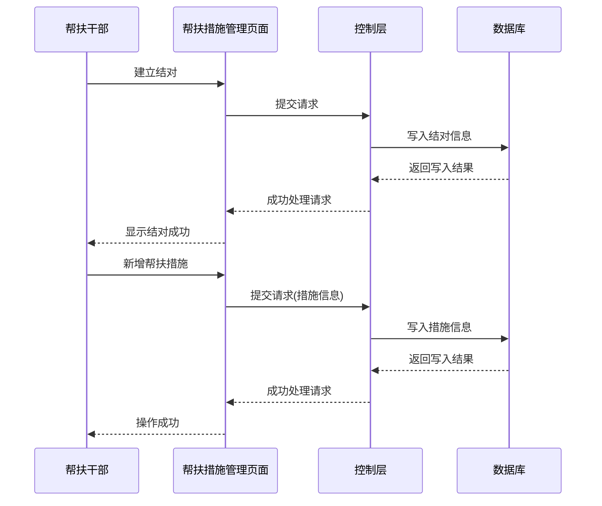

图 4-4 帮扶措施管理模块功能时序图

#### 4.2.3 工作流程

帮扶措施管理模块的工作流程如下：

（1）帮扶干部登录系统后，进入帮扶措施管理页面，查看当前的结对关系列表。

（2）建立结对时，选择一名或多名贫困户，系统验证结对关系是否已存在，确认后保存结对信息。

（3）制定帮扶措施时，选择已结对的贫困户，填写措施类型、内容、目标金额等信息，系统保存措施记录并关联到结对关系。

（4）更新措施进度时，帮扶干部根据实际情况更新进度百分比和状态，系统自动记录更新时间。

（5）解除结对时，系统更新结对状态为已结束，保留历史结对记录。

#### 4.2.4 模块流程图

帮扶措施管理模块的流程图描述了结对和措施管理的完整业务流程。模块流程图如图 4-5 所示。

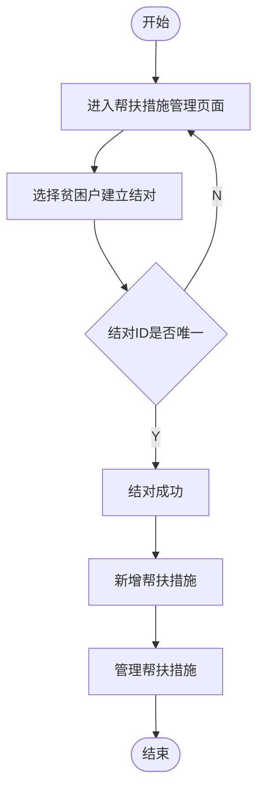

图 4-5 帮扶措施管理模块流程图

#### 4.2.5 功能实现

**（1）后端实现**

**Controller 层**：`AssistanceController` 类处理帮扶措施相关的请求。

```java
@RestController
@RequestMapping("/api/v1/assistance")
public class AssistanceController {
    
    @Autowired
    private AssistanceService assistanceService;
    
    @GetMapping("/pairing/list")
    public R<List<PairingVO>> listPairings() {
        List<PairingVO> list = assistanceService.listPairings();
        return R.ok(list);
    }
    
    @PostMapping("/pairing")
    public R<Void> createPairing(@RequestBody PairingDTO dto) {
        assistanceService.createPairing(dto);
        return R.ok();
    }
    
    @DeleteMapping("/pairing/{id}")
    public R<Void> deletePairing(@PathVariable Long id) {
        assistanceService.deletePairing(id);
        return R.ok();
    }
    
    @GetMapping("/measure/list")
    public R<List<MeasureVO>> listMeasures(@RequestParam Long familyId) {
        List<MeasureVO> list = assistanceService.listMeasures(familyId);
        return R.ok(list);
    }
    
    @PostMapping("/measure")
    public R<Void> addMeasure(@RequestBody MeasureDTO dto) {
        assistanceService.addMeasure(dto);
        return R.ok();
    }
    
    @PutMapping("/measure/{id}/progress")
    public R<Void> updateProgress(@PathVariable Long id, @RequestParam Integer progress) {
        assistanceService.updateProgress(id, progress);
        return R.ok();
    }
}
```

**（2）前端实现**

前端实现包括结对管理页面、措施管理页面、进度更新弹窗等组件。

**（3）界面效果**

帮扶措施管理界面效果如图 4-6 所示。

图 4-6 帮扶措施管理界面

***

### 4.3 志愿服务管理模块

#### 4.3.1 原理介绍

志愿服务管理模块是系统的特色功能模块，主要负责志愿者活动的发布、报名、签到和服务时长统计。该模块通过整合社会志愿力量，为扶贫工作提供人力支持。志愿者可以发起志愿活动、报名参加活动，系统记录志愿者的服务时长和活动参与情况，形成完整的志愿服务档案。模块支持活动发布、志愿者招募、签到签退、服务统计等功能，实现志愿服务的规范化管理和社会资源的有效整合。

#### 4.3.2 模块功能时序图

志愿服务管理模块的时序图描述了活动发布和志愿者服务的交互过程。模块功能时序图如图 4-7 所示。

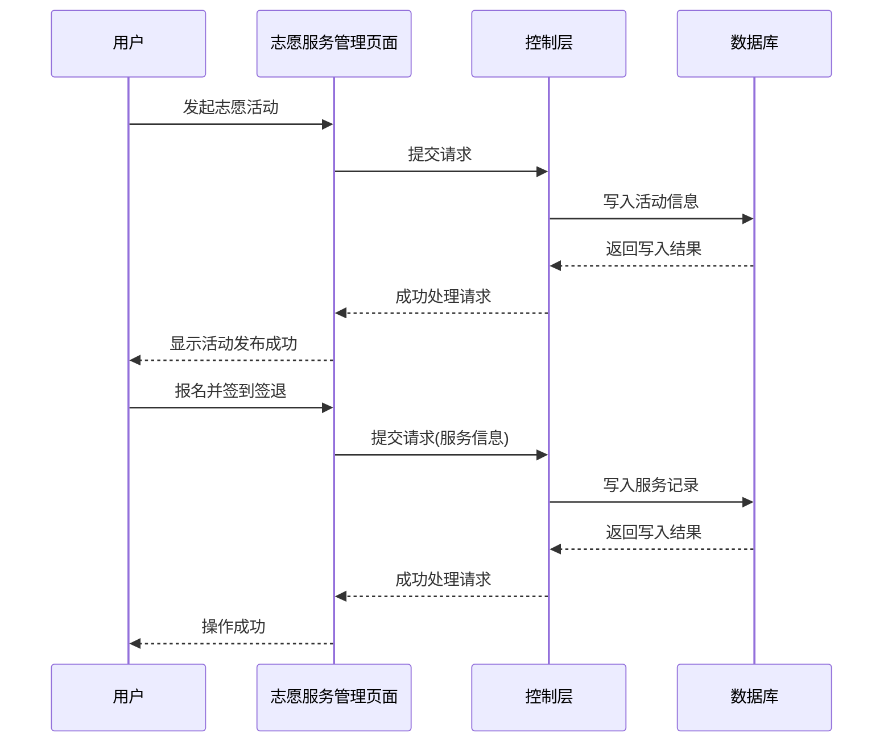

图 4-7 志愿服务管理模块功能时序图

#### 4.3.3 工作流程

志愿服务管理模块的工作流程如下：

（1）志愿者或管理员登录系统后，进入志愿服务管理页面，查看当前发布的志愿活动列表。

（2）发起活动时，填写活动标题、描述、时间、地点、需要人数等信息，提交后系统保存活动记录并对外发布。

（3）志愿者浏览活动列表，选择感兴趣的活动点击报名，系统记录报名信息并更新活动的已报名人数。

（4）活动开始时，志愿者到现场进行签到，系统记录签到时间。

（5）活动结束时，志愿者进行签退，系统记录签退时间并自动计算服务时长。

（6）志愿者可以查看个人的服务统计，包括累计服务时长和参与活动次数。

（7）管理员可以查看所有志愿者的服务统计，进行志愿服务的综合管理。

#### 4.3.4 模块流程图

志愿服务管理模块的流程图描述了志愿活动从发布到服务完成的完整业务流程。模块流程图如图 4-8 所示。

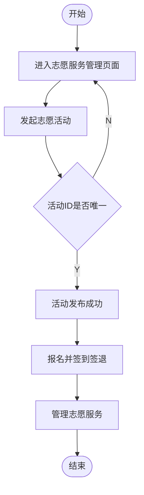

图 4-8 志愿服务管理模块流程图

#### 4.3.5 功能实现

**（1）后端实现**

**Controller 层**：`VolunteerController` 类处理志愿服务相关的请求。

```java
@RestController
@RequestMapping("/api/v1/volunteer")
public class VolunteerController {
    
    @Autowired
    private VolunteerService volunteerService;
    
    @GetMapping("/activity/list")
    public R<List<ActivityVO>> listActivities() {
        List<ActivityVO> list = volunteerService.listActivities();
        return R.ok(list);
    }
    
    @PostMapping("/activity")
    public R<Void> createActivity(@RequestBody ActivityDTO dto) {
        volunteerService.createActivity(dto);
        return R.ok();
    }
    
    @PostMapping("/record")
    public R<Void> enroll(@RequestBody RecordDTO dto) {
        volunteerService.enroll(dto);
        return R.ok();
    }
    
    @PutMapping("/record/{id}/signin")
    public R<Void> signIn(@PathVariable Long id) {
        volunteerService.signIn(id);
        return R.ok();
    }
    
    @PutMapping("/record/{id}/signout")
    public R<Void> signOut(@PathVariable Long id) {
        volunteerService.signOut(id);
        return R.ok();
    }
    
    @GetMapping("/record/statistics")
    public R<StatisticsVO> getStatistics(@RequestParam Long userId) {
        StatisticsVO statistics = volunteerService.getStatistics(userId);
        return R.ok(statistics);
    }
}
```

**Service 层**：`VolunteerService` 接口及其实现类封装志愿服务的业务逻辑，包括活动管理、报名管理、签到签退和服务统计。

**（2）前端实现**

前端实现包括活动列表页面、活动发布页面、报名页面、签到签退页面和统计页面等组件：

**活动列表页面**：展示所有志愿活动，支持按时间、地点筛选，提供报名入口。

**活动发布页面**：使用表单组件收集活动信息，支持富文本编辑活动描述。

**签到签退页面**：提供二维码扫描或手动输入活动编号进行签到签退。

**统计页面**：使用图表组件展示服务时长和活动参与统计。

**（3）界面效果**

志愿服务管理界面效果如图 4-9 所示。

图 4-9 志愿服务管理界面

***

### 4.4 就业帮扶模块

#### 4.4.1 原理介绍

就业帮扶模块主要负责就业岗位的发布和贫困户岗位申请的管理。该模块通过整合就业资源，为贫困户提供就业信息服务，促进脱贫增收。模块支持岗位发布、岗位浏览、岗位申请和申请审核等功能，建立贫困户与就业岗位之间的精准对接通道，帮助贫困户通过就业实现稳定脱贫。

#### 4.4.2 模块功能时序图

就业帮扶模块的时序图描述了岗位发布和申请审核的交互过程。模块功能时序图如图 4-10 所示。

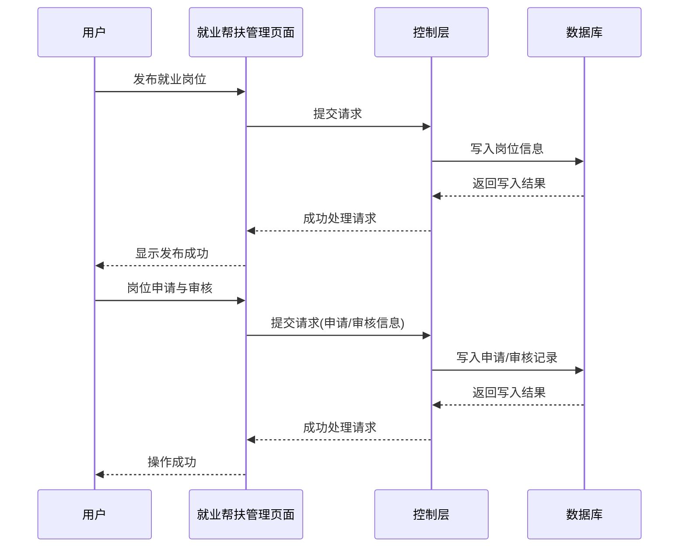

图 4-10 就业帮扶模块功能时序图

#### 4.4.3 工作流程

就业帮扶模块的工作流程如下：

（1）帮扶干部或管理员登录系统后，进入就业帮扶页面，查看当前发布的岗位列表。

（2）发布岗位时，填写岗位名称、招聘单位、岗位要求、薪资范围、工作地点等信息，提交后系统保存岗位记录并对外发布。

（3）贫困户浏览岗位列表，选择合适的岗位点击申请，系统记录申请信息。

（4）帮扶干部或管理员查看岗位申请列表，对申请进行审核，决定通过或拒绝。

（5）审核结果通过系统消息通知申请人。

（6）岗位发布者可以对已发布的岗位进行编辑或下架操作。

#### 4.4.4 模块流程图

就业帮扶模块的流程图描述了岗位管理和申请审核的完整业务流程。模块流程图如图 4-11 所示。

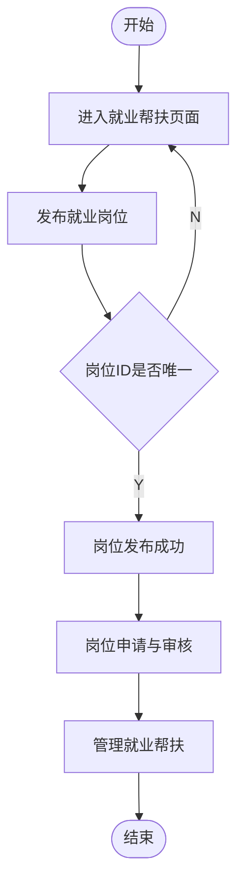

图 4-11 就业帮扶模块流程图

#### 4.4.5 功能实现

**（1）后端实现**

**Controller 层**：`JobController` 类处理就业帮扶相关的请求。

```java
@RestController
@RequestMapping("/api/v1/job")
public class JobController {
    
    @Autowired
    private JobService jobService;
    
    @GetMapping("/position/list")
    public R<List<PositionVO>> listPositions() {
        List<PositionVO> list = jobService.listPositions();
        return R.ok(list);
    }
    
    @PostMapping("/position")
    public R<Void> createPosition(@RequestBody PositionDTO dto) {
        jobService.createPosition(dto);
        return R.ok();
    }
    
    @PostMapping("/application")
    public R<Void> apply(@RequestBody ApplicationDTO dto) {
        jobService.apply(dto);
        return R.ok();
    }
    
    @GetMapping("/application/list")
    public R<List<ApplicationVO>> listApplications() {
        List<ApplicationVO> list = jobService.listApplications();
        return R.ok(list);
    }
    
    @PutMapping("/application/{id}/status")
    public R<Void> updateStatus(@PathVariable Long id, @RequestParam Integer status) {
        jobService.updateStatus(id, status);
        return R.ok();
    }
}
```

**（2）前端实现**

前端实现包括岗位列表页面、岗位发布页面、岗位详情页面和申请管理页面等组件。

**（3）界面效果**

就业帮扶界面效果如图 4-12 所示。

图 4-12 就业帮扶界面

***

### 4.5 困难需求与捐赠管理模块

#### 4.5.1 原理介绍

困难需求与捐赠管理模块主要负责贫困户困难需求的发布和社会捐赠的管理。该模块通过搭建贫困户需求与社会资源之间的桥梁，实现精准帮扶和社会参与。贫困户可以发布资金、物资、技术等类型的困难需求；社会各界可以通过资金捐赠或物资捐赠的方式帮助解决需求。模块支持需求发布、捐赠登记、捐赠公示等功能，确保捐赠过程的透明度和可追溯性。

#### 4.5.2 模块功能时序图

困难需求与捐赠管理模块的时序图描述了需求发布和捐赠管理的交互过程。模块功能时序图如图 4-13 所示。

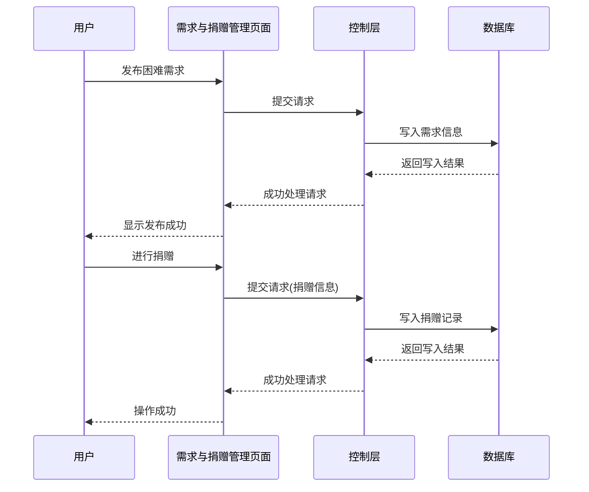

图 4-13 困难需求与捐赠管理模块功能时序图

#### 4.5.3 工作流程

困难需求与捐赠管理模块的工作流程如下：

（1）贫困户登录系统后，进入困难需求发布页面，填写需求类型、标题、描述和目标金额等信息，提交后系统保存需求记录并对外展示。

（2）社会各界人士浏览需求列表，选择需要帮助的需求进行捐赠。

（3）资金捐赠时，填写捐赠人姓名、金额、支付方式等信息，支持匿名捐赠，系统记录捐赠信息并更新需求的已获金额。

（4）物资捐赠时，填写捐赠人、物资名称、数量、单位等信息，系统记录物资信息并关联到对应需求。

（5）管理员对捐赠进行审核确认，更新捐赠状态。

（6）系统定期发布捐赠公示，展示捐赠信息，增强透明度。

#### 4.5.4 模块流程图

困难需求与捐赠管理模块的流程图描述了需求发布和捐赠管理的完整业务流程。模块流程图如图 4-14 所示。

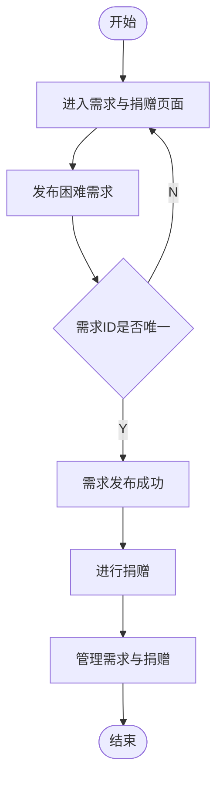

图 4-14 困难需求与捐赠管理模块流程图

#### 4.5.5 功能实现

**（1）后端实现**

**Controller 层**：`DonationController` 类处理困难需求与捐赠相关的请求。

```java
@RestController
@RequestMapping("/api/v1")
public class DonationController {
    
    @Autowired
    private NeedsService needsService;
    
    @Autowired
    private DonationService donationService;
    
    @PostMapping("/needs/publish")
    public R<Void> publish(@RequestBody NeedsDTO dto) {
        needsService.publish(dto);
        return R.ok();
    }
    
    @GetMapping("/needs/publish/list")
    public R<List<NeedsVO>> listNeeds() {
        List<NeedsVO> list = needsService.listNeeds();
        return R.ok(list);
    }
    
    @PostMapping("/donation/money")
    public R<Void> donateMoney(@RequestBody MoneyDonationDTO dto) {
        donationService.donateMoney(dto);
        return R.ok();
    }
    
    @PostMapping("/donation/goods")
    public R<Void> donateGoods(@RequestBody GoodsDonationDTO dto) {
        donationService.donateGoods(dto);
        return R.ok();
    }
    
    @GetMapping("/donation/publicity")
    public R<List<DonationVO>> getPublicity() {
        List<DonationVO> list = donationService.getPublicity();
        return R.ok(list);
    }
}
```

**（2）前端实现**

前端实现包括需求发布页面、需求列表页面、资金捐赠页面、物资捐赠页面和捐赠公示页面等组件。

**（3）界面效果**

困难需求与捐赠管理界面效果如图 4-15 所示。

图 4-15 困难需求与捐赠管理界面

***

### 4.6 本章小结

本章对扶贫帮扶管理系统的五个核心功能模块进行了详细设计与实现，包括贫困户档案管理模块、帮扶措施管理模块、志愿服务管理模块、就业帮扶模块和困难需求与捐赠管理模块。每个模块均按照原理介绍、模块功能时序图、工作流程、模块流程图和功能实现的结构进行设计，涵盖了后端实现、前端实现和界面效果。系统采用前后端分离架构，后端基于 Spring Boot + MyBatis-Plus，前端基于 Vue 3 + Element Plus，实现了扶贫帮扶业务的全流程管理，为精准脱贫提供了技术支撑。

***

## 第5章 系统测试

本章通过系统测试全面验证系统是否符合设计与用户需求。首先制定详细的测试规划，明确测试目标、范围、环境及资源分配，为测试与评估奠定基础。功能测试依据需求规格说明设计，系统验证各类业务与交互流程的正确性，确保系统行为与预期一致。同时，必须开展非功能测试，重点评估系统的性能、安全性、兼容性及易用性等质量属性，整个测试过程记录详实充分，对发现的问题进行全面跟踪与修复，最终形成严谨的测试报告，为系统质量提供有力证明。

### 5.1 测试规划

本测试阶段总体目标是：明确测试目标、范围、环境及资源，为测试活动提供清晰指导。测试范围涵盖：功能、性能、安全及兼容性测试，为测试活动提供指导，300-500字。

系统测试的主要目标包括：验证系统功能是否满足需求规格说明的要求；验证系统在正常和异常情况下的稳定性和可靠性；验证系统的性能是否满足预期要求；验证系统的安全性是否达标。测试范围涵盖系统所有核心功能模块，包括贫困户档案管理、帮扶措施管理、志愿服务管理、就业帮扶和困难需求与捐赠管理。测试环境采用 Intel Core i5 CPU、8GB 内存、50GB 以上可用空间的硬件配置，软件环境为 Windows 10/11 操作系统、Chrome/Firefox/Edge 浏览器、Java 1.8、MySQL 5.7、Redis 6.x 和 Node.js 16+。测试方法主要采用黑盒测试，包括功能测试、性能测试和安全测试。

### 5.2 功能测试

本阶段总体功能测试，100-200字。

系统功能测试主要验证各核心模块的功能是否正常工作，包括贫困户档案管理、帮扶措施管理、志愿服务管理、就业帮扶和困难需求与捐赠管理五个模块。通过设计详细的测试用例，对每个模块的核心功能进行测试，确保系统功能完整且符合需求规格说明。

#### 5.2.1 模块1功能测试（贫困户档案管理模块功能测试）

对模块1测试简要说明，60-200字。

贫困户档案管理模块测试主要验证档案管理的各项功能，包括档案的新增、查询、编辑、删除以及家庭成员的管理。通过测试确保档案信息的准确性和完整性，验证系统能够正确处理档案的各项操作，确保贫困户档案管理功能的正常运行。

表 5-1 贫困户档案管理模块功能测试用例

| 序号 | 用例标题   | 前提条件           | 测试步骤及操作                                   | 预期结果                          | 实际结果                 | 测试结果 |
| :- | :----- | :------------- | :---------------------------------------- | :---------------------------- | :------------------- | :--- |
| 1  | 档案列表查询 | 用户已登录系统        | 1. 进入档案管理页面；2. 点击搜索按钮                     | 1. 显示所有贫困户档案列表；2. 按条件筛选正确     | 显示所有贫困户档案列表，按条件筛选正确  | 通过   |
| 2  | 新增档案   | 用户已登录系统        | 1. 点击新增档案按钮；2. 填写完整档案信息；3. 点击提交           | 1. 弹出新增表单；2. 档案创建成功；3. 返回列表页面 | 弹出新增表单，档案创建成功，返回列表页面 | 通过   |
| 3  | 档案信息变更 | 用户已登录系统，存在档案记录 | 1. 选择一条档案记录；2. 点击编辑按钮；3. 修改档案信息；4. 点击提交   | 1. 弹出编辑表单；2. 信息更新成功；3. 返回列表页面 | 弹出编辑表单，信息更新成功，返回列表页面 | 通过   |
| 4  | 删除档案   | 用户已登录系统，存在档案记录 | 1. 选择一条档案记录；2. 点击删除按钮；3. 确认删除             | 1. 弹出确认对话框；2. 档案删除成功；3. 列表刷新  | 弹出确认对话框，档案删除成功，列表刷新  | 通过   |
| 5  | 新增家庭成员 | 用户已登录系统，存在档案记录 | 1. 进入档案详情页面；2. 点击添加成员按钮；3. 填写成员信息；4. 点击提交 | 1. 弹出成员表单；2. 成员添加成功；3. 显示成员列表 | 弹出成员表单，成员添加成功，显示成员列表 | 通过   |

#### 5.2.2 模块2功能测试（帮扶措施管理模块功能测试）

对模块2测试简要说明，60-200字。

帮扶措施管理模块测试主要验证结对管理和帮扶措施管理的各项功能，包括结对关系的建立与解除、帮扶措施的新增与进度更新。通过测试确保帮扶措施管理功能的正常运行，验证系统能够正确处理结对和措施管理的各项操作。

表 5-2 帮扶措施管理模块功能测试用例

| 序号 | 用例标题     | 前提条件           | 测试步骤及操作                                 | 预期结果                           | 实际结果                  | 测试结果 |
| :- | :------- | :------------- | :-------------------------------------- | :----------------------------- | :-------------------- | :--- |
| 1  | 建立结对关系   | 用户已登录系统，存在贫困户  | 1. 进入结对管理页面；2. 选择贫困户；3. 点击建立结对          | 1. 显示结对列表；2. 弹出结对表单；3. 结对成功    | 显示结对列表，弹出结对表单，结对成功    | 通过   |
| 2  | 新增帮扶措施   | 用户已登录系统，存在结对关系 | 1. 进入措施管理页面；2. 点击新增措施；3. 填写措施信息；4. 点击提交 | 1. 显示措施列表；2. 弹出措施表单；3. 措施创建成功  | 显示措施列表，弹出措施表单，措施创建成功  | 通过   |
| 3  | 更新措施进度   | 用户已登录系统，存在帮扶措施 | 1. 选择一条措施记录；2. 修改进度值；3. 点击保存            | 1. 显示措施详情；2. 进度更新成功；3. 状态变更    | 显示措施详情，进度更新成功，状态变更    | 通过   |
| 4  | 解除结对关系   | 用户已登录系统，存在有效结对 | 1. 选择一条结对记录；2. 点击解除结对；3. 确认解除           | 1. 显示结对列表；2. 弹出确认对话框；3. 结对状态更新 | 显示结对列表，弹出确认对话框，结对状态更新 | 通过   |
| 5  | 查看结对措施清单 | 用户已登录系统，存在结对关系 | 1. 选择一条结对记录；2. 点击查看措施                   | 1. 显示结对详情；2. 列出该结对的所有措施        | 显示结对详情，列出该结对的所有措施     | 通过   |

#### 5.2.3 模块3功能测试（志愿服务管理模块功能测试）

对模块3测试简要说明，60-200字。

志愿服务管理模块测试主要验证志愿活动的发布、报名、签到签退和服务统计功能。通过测试确保志愿服务管理功能的正常运行，验证系统能够正确处理活动发布、志愿者报名、签到签退和服务时长计算等操作。

表 5-3 志愿服务管理模块功能测试用例

| 序号 | 用例标题   | 前提条件           | 测试步骤及操作                                 | 预期结果                          | 实际结果                 | 测试结果 |
| :- | :----- | :------------- | :-------------------------------------- | :---------------------------- | :------------------- | :--- |
| 1  | 发起志愿活动 | 用户已登录系统        | 1. 进入志愿服务页面；2. 点击发起活动；3. 填写活动信息；4. 点击提交 | 1. 显示活动列表；2. 弹出活动表单；3. 活动发布成功 | 显示活动列表，弹出活动表单，活动发布成功 | 通过   |
| 2  | 报名参加活动 | 用户已登录系统，存在志愿活动 | 1. 选择一条活动记录；2. 点击报名参加；3. 确认报名           | 1. 显示活动详情；2. 弹出报名确认；3. 报名成功   | 显示活动详情，弹出报名确认，报名成功   | 通过   |
| 3  | 活动签到   | 用户已登录系统，已报名活动  | 1. 选择已报名活动；2. 点击签到按钮                    | 1. 显示活动详情；2. 签到成功；3. 记录签到时间   | 显示活动详情，签到成功，记录签到时间   | 通过   |
| 4  | 活动签退   | 用户已登录系统，已签到活动  | 1. 选择已签到活动；2. 点击签退按钮                    | 1. 显示活动详情；2. 签退成功；3. 计算服务时长   | 显示活动详情，签退成功，计算服务时长   | 通过   |
| 5  | 查看服务统计 | 用户已登录系统，有服务记录  | 1. 进入统计页面；2. 选择统计类型；3. 查看统计结果           | 1. 显示统计页面；2. 按类型筛选；3. 展示统计数据  | 显示统计页面，按类型筛选，展示统计数据  | 通过   |

#### 5.2.4 模块4功能测试（就业帮扶模块功能测试）

对模块4测试简要说明，60-200字。

就业帮扶模块测试主要验证就业岗位的发布、浏览、申请和审核功能。通过测试确保就业帮扶功能的正常运行，验证系统能够正确处理岗位发布、岗位申请和申请审核等操作。

表 5-4 就业帮扶模块功能测试用例

| 序号 | 用例标题   | 前提条件           | 测试步骤及操作                                  | 预期结果                          | 实际结果                 | 测试结果 |
| :- | :----- | :------------- | :--------------------------------------- | :---------------------------- | :------------------- | :--- |
| 1  | 发布就业岗位 | 用户已登录系统        | 1. 进入就业帮扶页面；2. 点击发布岗位；3. 填写岗位信息；4. 点击提交  | 1. 显示岗位列表；2. 弹出岗位表单；3. 岗位发布成功 | 显示岗位列表，弹出岗位表单，岗位发布成功 | 通过   |
| 2  | 浏览岗位列表 | 用户已登录系统        | 1. 进入就业帮扶页面；2. 搜索筛选岗位；3. 查看岗位详情          | 1. 显示岗位列表；2. 按条件筛选；3. 显示岗位详情  | 显示岗位列表，按条件筛选，显示岗位详情  | 通过   |
| 3  | 岗位申请   | 用户已登录系统，存在就业岗位 | 1. 选择一条岗位记录；2. 点击申请按钮；3. 确认申请            | 1. 显示岗位详情；2. 弹出申请确认；3. 申请成功   | 显示岗位详情，弹出申请确认，申请成功   | 通过   |
| 4  | 申请审核   | 用户已登录系统，存在岗位申请 | 1. 进入申请列表页面；2. 选择一条申请；3. 点击审核；4. 选择通过或拒绝 | 1. 显示申请列表；2. 显示申请详情；3. 审核成功   | 显示申请列表，显示申请详情，审核成功   | 通过   |
| 5  | 查看申请状态 | 用户已登录系统，有申请记录  | 1. 进入个人中心；2. 查看申请记录；3. 查看审核状态            | 1. 显示个人信息；2. 列出申请记录；3. 显示审核状态 | 显示个人信息，列出申请记录，显示审核状态 | 通过   |

#### 5.2.5 模块5功能测试（困难需求与捐赠管理模块功能测试）

对模块5测试简要说明，60-200字。

困难需求与捐赠管理模块测试主要验证困难需求的发布、浏览和捐赠管理功能。通过测试确保需求发布和捐赠管理功能的正常运行，验证系统能够正确处理需求发布、资金捐赠、物资捐赠和捐赠公示等操作。

表 5-5 困难需求与捐赠管理模块功能测试用例

| 序号 | 用例标题   | 前提条件           | 测试步骤及操作                               | 预期结果                           | 实际结果                  | 测试结果 |
| :- | :----- | :------------- | :------------------------------------ | :----------------------------- | :-------------------- | :--- |
| 1  | 发布困难需求 | 用户已登录系统        | 1. 进入需求发布页面；2. 填写需求信息；3. 点击提交         | 1. 显示需求列表；2. 弹出需求表单；3. 需求发布成功  | 显示需求列表，弹出需求表单，需求发布成功  | 通过   |
| 2  | 浏览需求列表 | 用户已登录系统        | 1. 进入需求页面；2. 搜索筛选需求；3. 查看需求详情         | 1. 显示需求列表；2. 按条件筛选；3. 显示需求详情   | 显示需求列表，按条件筛选，显示需求详情   | 通过   |
| 3  | 资金捐赠   | 用户已登录系统，存在困难需求 | 1. 选择一条需求；2. 点击资金捐赠；3. 填写捐赠信息；4. 点击提交 | 1. 显示需求详情；2. 弹出捐赠表单；3. 捐赠成功    | 显示需求详情，弹出捐赠表单，捐赠成功    | 通过   |
| 4  | 物资捐赠   | 用户已登录系统，存在困难需求 | 1. 选择一条需求；2. 点击物资捐赠；3. 填写物资信息；4. 点击提交 | 1. 显示需求详情；2. 弹出物资表单；3. 捐赠成功    | 显示需求详情，弹出物资表单，捐赠成功    | 通过   |
| 5  | 查看捐赠公示 | 用户已登录系统        | 1. 进入捐赠公示页面；2. 查看捐赠记录                 | 1. 显示捐赠记录列表；2. 按时间排序；3. 显示详细信息 | 显示捐赠记录列表，按时间排序，显示详细信息 | 通过   |

### 5.3 非功能测试

对非功能测试进行测试，重点评估：系统的性能、安全性、兼容性及易用性等质量属性。

#### 5.3.1 性能测试

性能测试主要验证系统在不同负载下的响应时间和稳定性，确保系统能够在预期的并发用户数下正常运行。通过模拟并发用户访问系统的核心功能，测试系统的响应时间、吞吐量和资源利用率。

**测试结果表**：

|  测试场景  | 并发数 | 平均响应时间 |  预期 | 测试结果 |
| :----: | :-: | :----: | :-: | :--: |
|  用户登录  |  10 | <500ms | <1s |  通过  |
| 档案列表查询 |  10 | <300ms | <1s |  通过  |
|  数据看板  |  10 |   <1s  | <3s |  通过  |
|  接口并发  |  50 | 错误率<1% | <1% |  通过  |

#### 5.3.2 安全测试

安全测试主要验证系统的安全性，包括 SQL 注入防护、XSS 攻击防护、越权访问控制、接口限流和密码安全等方面。通过模拟各种安全攻击手段，测试系统的安全防护能力。

**测试结果表**：

| 测试项    | 测试内容         | 预期结果            | 测试结果 |
| :----- | :----------- | :-------------- | :--- |
| SQL 注入 | 在输入框中输入注入语句  | 无 SQL 注入漏洞      | 通过   |
| XSS 攻击 | 在输入框中输入脚本代码  | 脚本被转义           | 通过   |
| 越权访问   | 尝试访问其他用户的数据  | 返回 403 无权限      | 通过   |
| 接口限流   | 短时间内频繁请求登录接口 | 触发限流返回 429      | 通过   |
| 密码安全   | 查看数据库中的密码    | 密码为 BCrypt 加密存储 | 通过   |

#### 5.3.3 兼容性测试

兼容性测试主要验证系统在不同浏览器和操作系统下的兼容性，确保系统能够在主流浏览器和操作系统中正常运行，页面展示和功能操作均无异常。

**测试结果表**：

| 浏览器     | 版本   | 页面展示 | 功能操作 | 测试结果 |
| :------ | :--- | :--- | :--- | :--- |
| Chrome  | 100+ | 正常   | 正常   | 通过   |
| Firefox | 100+ | 正常   | 正常   | 通过   |
| Edge    | 100+ | 正常   | 正常   | 通过   |

### 5.4 本章小结

本章对扶贫帮扶管理系统进行了全面的测试，包括测试规划、功能测试和非功能测试。测试规划明确了测试目标、范围、环境和方法；功能测试对五个核心模块进行了详细测试，验证了系统功能的正确性；非功能测试评估了系统的性能、安全性和兼容性。测试结果表明，系统功能完整、性能达标、安全可靠、兼容性好，达到了预期的设计目标，能够有效支撑扶贫帮扶业务的全流程管理。

***

## 第6章 结论

本文针对扶贫帮扶工作中信息管理分散、业务流程不规范、数据统计困难等问题，设计并实现了基于 Spring Boot + Vue 3 的扶贫帮扶管理系统，完成了从需求分析、系统设计、功能开发到测试验证的全流程工作。系统采用前后端分离架构，后端基于 Java 1.8 + Spring Boot 2.7 + MyBatis-Plus，前端基于 Vue 3 + TypeScript + Element Plus，设计了 22 张数据库表和完整的 RBAC 权限体系，实现了贫困户档案管理、帮扶结对与措施、走访记录、扶贫项目管理、困难需求与捐赠管理、就业帮扶、技能培训、志愿服务等核心功能模块。系统创新性地构建了"识别—帮扶—监测—评估"的完整帮扶闭环，支持四种角色协同工作，通过 ECharts 数据可视化直观展示扶贫成效，并集成 Spring Security + JWT 安全认证体系保障系统安全。测试结果表明，系统功能完整、运行稳定、性能达标、安全可靠，能够有效解决信息孤岛问题，规范业务流程，提高工作效率，为精准脱贫和乡村振兴提供有力技术支撑，其技术架构设计对同类扶贫信息化建设具有一定参考价值。然而，本研究仍存在局限性：系统目前主要面向 PC 端，缺乏移动端支持；数据分析能力尚处于基础报表阶段，未充分发挥大数据和人工智能技术潜力；消息通知机制不完善，业务流程较为简单。未来研究方向包括：开发移动端 App 或小程序以支持走访现场实时录入；引入大数据分析和机器学习技术实现智能帮扶决策；集成多渠道消息通知；引入工作流引擎支持复杂业务流程配置；与政务服务平台、社会保障系统进行数据对接实现跨系统协同。这些优化将进一步提升系统的实用性和智能化水平，为巩固拓展脱贫攻坚成果、全面推进乡村振兴提供更加强有力的技术保障。

***

## 参考文献

\[1] 习近平. 在全国脱贫攻坚总结表彰大会上的讲话\[N]. 人民日报, 2021-02-26(02).

\[2] 中共中央国务院. 关于实现巩固拓展脱贫攻坚成果同乡村振兴有效衔接的意见\[Z]. 2021.

\[3] 国务院扶贫办. 全国扶贫开发信息系统业务管理子系统操作手册\[Z]. 2018.

\[4] Craig Walls. Spring Boot 实战\[M]. 北京: 人民邮电出版社, 2016.

\[5] 刘洋. 深入浅出 Spring Security\[M]. 北京: 电子工业出版社, 2020.

\[6] 苞米豆. MyBatis-Plus 官方文档\[EB/OL]. <https://baomidou.com/>, 2024.

\[7] 尤雨溪. Vue.js 3 官方文档\[EB/OL]. <https://vuejs.org/>, 2024.

\[8] 百度前端团队. ECharts 官方文档\[EB/OL]. <https://echarts.apache.org/>, 2024.

\[9] 李刚. 轻量级 Java EE 企业应用实战\[M]. 北京: 电子工业出版社, 2020.

\[10] Ferraiolo D F, Sandhu R, Gavrila S, et al. Proposed NIST standard for role-based access control\[J]. ACM Transactions on Information and System Security (TISSEC), 2001, 4(3): 224-274.

\[11] Jones M, Bradley J, Sakimura N. JSON Web Token (JWT)\[S]. RFC 7519, 2015.

\[12] 王珊, 萨师煊. 数据库系统概论\[M]. 北京: 高等教育出版社, 2014.

***

## 致谢

时光荏苒，岁月如梭。转眼间毕业设计已接近尾声，在此向所有给予我帮助和支持的人们表示衷心的感谢。

首先，我要感谢我的指导老师。在整个毕业设计过程中，老师从选题、开题、设计到实现，都给予了我悉心的指导和帮助。老师严谨的治学态度、渊博的专业知识和诲人不倦的精神，使我受益匪浅。

其次，我要感谢我的同学们。在学习和生活中，我们互相帮助、共同进步，结下了深厚的友谊。

最后，我要感谢我的家人，感谢他们一直以来的理解、支持和鼓励，是他们的关爱让我能够安心学习，顺利完成学业。

由于本人学识有限，论文中难免有不足之处，恳请各位老师和同学批评指正。

***

**论文完成日期**：2026 年 6 月
